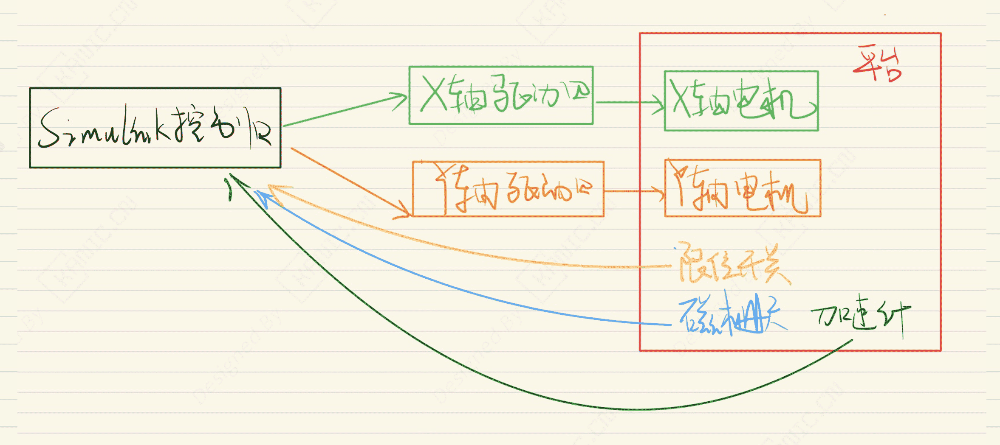
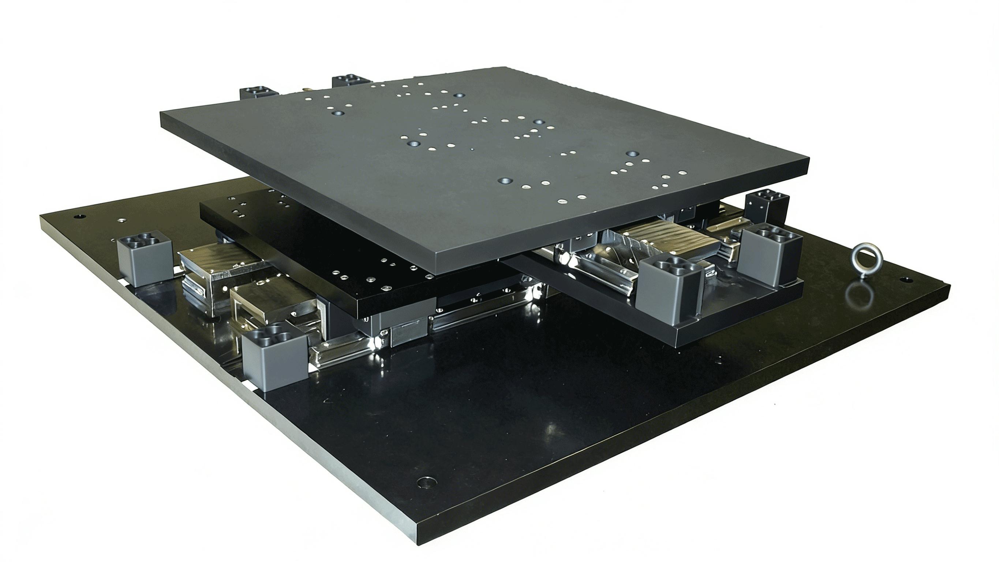

# 两自由度移动平台搭建-EXP-运动控制-XY平台

---

## 实验目的

摘要：

本项目展示了一个XY两自由度移动平台，X轴和Y轴均由直线电机驱动，配备磁栅尺实现精确位移测量，限位开关确保运动安全，每个轴上还安装加速度计采集动态信息。系统通过上位机Simulink控制，结合DAQ设备实现闭环控制与数据采集，便于进行运动控制实验、算法验证和动力学分析，为自动化实验教学和科研提供可视化和可复现的控制平台。

- 关键词：Parker R10-3A，AMC B060A400AC；三相无刷电机；运动控制；Simulink 仿真控制，Omron EE-SPY415，ADXL210E，加速计，LIDA 477 磁栅尺

> 注：本文仅从实验系统与工程实现角度进行记录。

---

## 实验系统整体结构

下图为根据实验内容整理的系统结构框图。

---

## 关键信号与实验流程说明（精炼版）

1.  Simulink控制器 生成运动控制指令到 驱动器  
2. 驱动 X 轴和 Y 轴的直线电机执行运动  
4. 磁栅尺测量 X/Y 轴位移  
6. 加速度计测量 X/Y 轴加速度  
7. 限位开关监测 X/Y 轴极限位置  
8. 所有传感器数据和限位状态反馈回 Simulink控制器

---

## 实验数据与现场

---

## 说明

> **结构框图来源于实际实验平台验证后的通用实现形式，细节根据具体硬件版本略有差异**。

## 涉及的部分硬件

- **Parker R10-3A 三相无刷直线电机** 
- **ADXL210E 双轴加速度模块** 
- **Omron EE-SPY415 行程限位开关**
- **LIDA 477 磁栅尺** 
- **AMC B30A40AC B060A400AC 电机驱动器**

> **以上配置仅用于说明实验背景，不同应用场景下可采用等效方案。**

## 交流说明

>本文首发于【GitHub/Gitee】，作者：KANIC，研究方向为 自动化实验平台、控制算法验证及半实物仿真系统。

相关实验或程序已整理至 GitHub，可在 GitHub 平台搜索 KANIC-lab/KANIC 查看。

如需进一步讨论，可私信联系，并注明文章编号。文章编号位于标题末尾，以字母开头如“EXP-XXXX-XXX”
