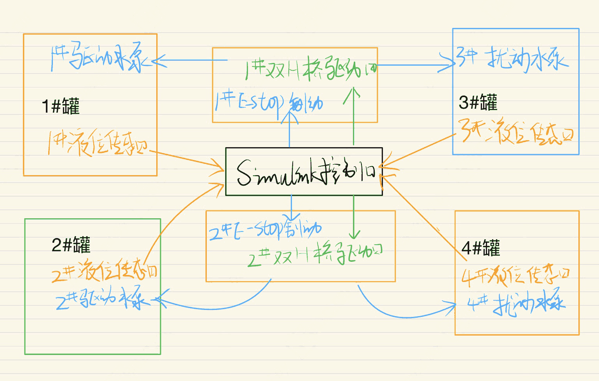
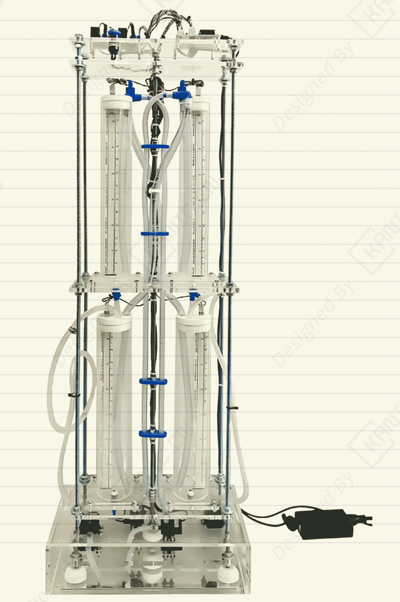

# 多水箱液位闭环控制-EXP-液位-多通道

---

## 实验目的

摘要：

本项目实现了一套基于半实物仿真 搭建四水箱液位控制实验系统，集成液位测量、PWM 水泵驱动与扰动注入，适用于控制算法教学与实验验证。

关键词：半实物; PWM; 液位传感器; 液位控制; 闭环控制; 多水箱系统; 控制实验平台; 扰动注入; simulink; **VMA421 水泵**；双 H 桥驱动；**Milone Technologies PN-12110215TC-12**

> 注：本文仅从实验系统与工程实现角度进行记录。

---

## 实验系统整体结构

下图为根据实验内容整理的系统结构框图。

---

## 关键信号与实验流程说明（精炼版）

- 水箱液位变化 → 作用于液位传感器  
2. 液位传感器 → 输出模拟电压信号  
3. 输出模拟电压信号→ 发送数据给控制器  
5. 控制器  → 输出 PWM 信号  
6. PWM 信号 → 双H桥驱动模块 → 水泵 → 产生扰动 
7. PWM 信号 → 双H桥驱动模块 → 水泵 → 改变水流量  

> 说明：仅记录信号在系统中的流向与作用，不涉及控制算法或具体参数。

---

## 实验数据与现场

---

## 涉及的部分硬件

- **Velleman VMA421 无刷直流潜水泵**   
- L298N 双 H 桥驱动模块
- Milone Technologies PN-12110215TC-12 电阻式液位传感器 
- E-Stop 紧急制动开关

> **以上配置仅用于说明实验背景，不同应用场景下可采用等效方案。**

## 说明

> **结构框图来源于实际实验平台验证后的通用实现形式，细节根据具体硬件版本略有差异**。

## 交流说明

>本文首发于【GitHub/Gitee】，作者：KANIC，研究方向为 自动化实验平台、控制算法验证及半实物仿真系统。

相关实验或程序已整理至 GitHub，可在 GitHub 平台搜索 KANIC-lab/KANIC 查看。

如需进一步讨论，可私信联系，并注明文章编号。文章编号位于标题末尾，以字母开头如“EXP-XXXX-XXX”
