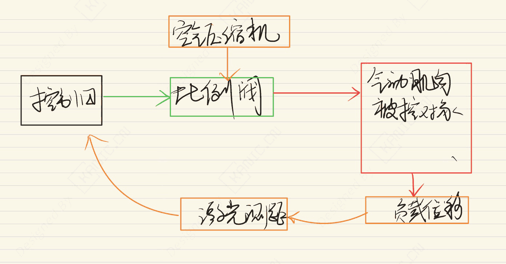
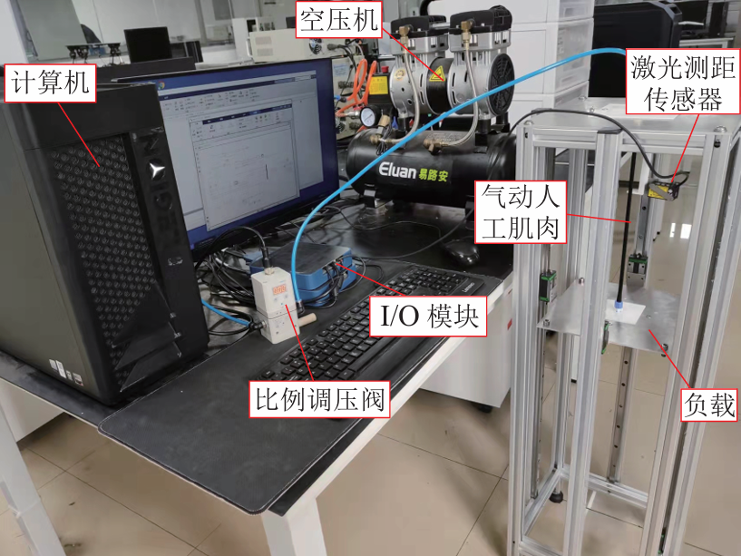

# 气动人工肌肉的控制-EXP-自动控制-气动肌肉

---

## 实验目的

摘要：

​    本文搭建了基于气动人工肌肉的控制实验平台，并在 Simulink 环境下完成系统建模与轨迹跟踪控制算法设计。通过仿真与实验分析系统动态响应特性，为气动人工肌肉控制算法的工程实现与教学实验提供支持。

关键词：软体机器人;垂直气动人工肌肉系统; simulink; **Festo 比例调压阀**；Panasonic激光测距传感器；**Eluan 空压机**

> 注：本文仅从实验系统与工程实现角度进行记录。

---

## 实验系统整体结构

下图为根据实验内容整理的系统结构框图。

---

## 关键信号与实验流程说明（精炼版）

控制信号：  
计算机 →  比例调压阀  

气压通道：  
空压机 → 比例调压阀 → 气动人工肌肉系统 

反馈通道：  
气动人工肌肉系统（输出位移） → 激光测距传感器 → 计算机

> 说明：仅记录信号在系统中的流向与作用，不涉及控制算法或具体参数。

---

## 实验数据与现场

---

## 涉及的部分硬件

- **Festo VPPE-3-1-1/8 2-010-E1 比例调压阀**   
- Panasonic HG-C1200激光测距传感器
- Eluan ES18L 空压机

> **以上配置仅用于说明实验背景，不同应用场景下可采用等效方案。**

## 说明

> **结构框图来源于实际实验平台验证后的通用实现形式，细节根据具体硬件版本略有差异**。

## 交流说明

>本文首发于【GitHub/Gitee】，作者：KANIC，研究方向为 自动化实验平台、控制算法验证及半实物仿真系统。

相关实验或程序已整理至 GitHub，可在 GitHub 平台搜索 KANIC-lab/KANIC 查看。

如需进一步讨论，可私信联系，并注明文章编号。文章编号位于标题末尾，以字母开头如“EXP-XXXX-XXX”
