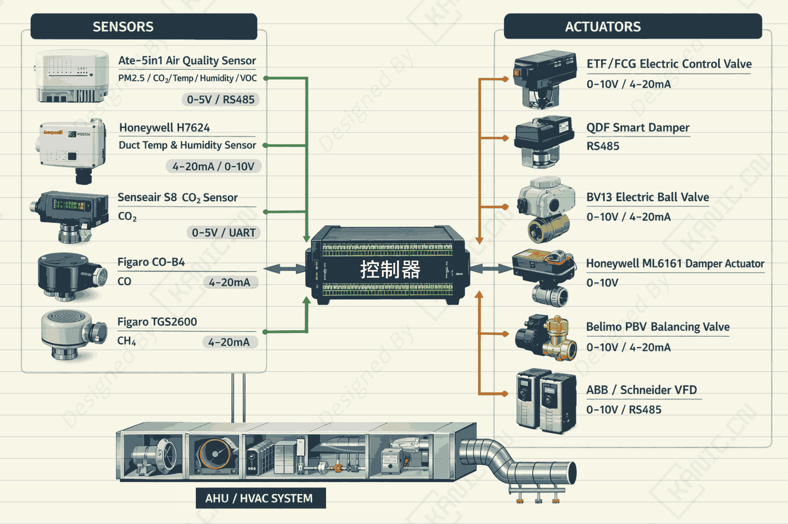

# 楼宇自动化智能控制系统-EXP-楼宇智能-多通道

---

## 实验目的

摘要：

本项目展示了如何将大型楼宇自动化系统的各类传感器与执行器直接接入Simulink，实现多通道、多变量的监测与闭环控制。使工程人员能够快速搭建实验或工程验证平台，支持温湿度、空气质量、风机和阀门等设备的实时控制。

关键词：- 楼宇自动化  HVAC控制  空气质量监测   PID控制  模糊控制  RS485  Simulink  风机阀门执行器  智能楼宇  
> 注：本文仅从实验系统与工程实现角度进行记录。

---

## 实验系统整体结构

下图为根据实验内容整理的系统结构框图。

---

## 关键信号与实验流程说明（精炼版）

3. 输出模拟电压信号→ 发送数据给控制器  
5. 控制器  → 输出 PWM 信号  
6. PWM 信号 → 双H桥驱动模块 → 水泵 → 产生扰动 
7. PWM 信号 → 双H桥驱动模块 → 水泵 → 改变水流量  

> 说明：仅记录信号在系统中的流向与作用，不涉及控制算法或具体参数。

---

## 涉及的部分硬件

- ## 传感器列表

  | 类型                 | 品牌/型号                   | 测量参数                |
  | -------------------- | --------------------------- | ----------------------- |
  | 空气质量五合一传感器 | Ate系列（Ate-5in1）         | PM2.5, CO₂, 温湿度, VOC |
  | 管道温湿度传感器     | Honeywell H7624 / TBD       | 温度, 湿度              |
  | CO₂传感器            | Senseair S8 / Telaire T6700 | CO₂ ppm                 |
  | 一氧化碳传感器       | Figaro CO-B4                | CO ppm                  |
  | 甲烷/可燃气体传感器  | Figaro TGS2600              | CH₄ ppm                 |

  ## 执行器列表

  | 类型             | 品牌/型号           | 控制方式       |
  | ---------------- | ------------------- | -------------- |
  | 电动调节阀       | ETF/FCG系列         | 开度0-100%     |
  | 智能电动蝶阀     | QDF系列             | 开度0-100%     |
  | 电动球阀         | BV13系列            | 开度0-100%     |
  | 风门执行器       | Honeywell ML6161    | 开度0-100%     |
  | 水力平衡阀       | Belimo PBV系列      | 开度0-100%     |
  | 送排风机变频控制 | ABB / Schneider VFD | 频率控制0-50Hz |

> **以上配置仅用于说明实验背景，不同应用场景下可采用等效方案。**

## 说明

> **结构框图来源于实际实验平台验证后的通用实现形式，细节根据具体硬件版本略有差异**。

## 交流说明

>本文首发于【GitHub/Gitee】，作者：KANIC，研究方向为 自动化实验平台、控制算法验证及半实物仿真系统。

相关实验或程序已整理至 GitHub，可在 GitHub 平台搜索 KANIC-lab/KANIC 查看。

如需进一步讨论，可私信联系，并注明文章编号。文章编号位于标题末尾，以字母开头如“EXP-XXXX-XXX”
