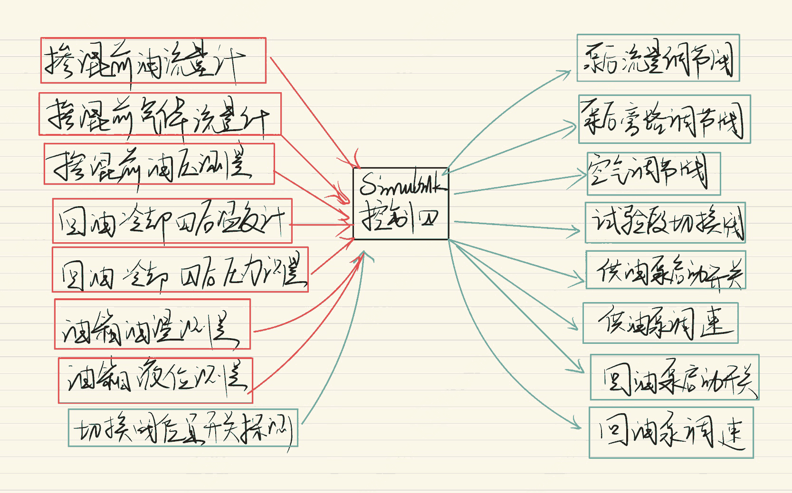

# 润滑油循环供给控制系统-EXP-润滑油循环-多通道

---

## 实验目的

摘要：

本文介绍了润滑油循环供给与控制系统的设计、分析与实现。该系统集成硬件组件，用于精确控制油流调节、压力监测和温度控制提高了效率和安全性。

关键词：- **温度变送器**  **压力变送器**  **液位变送器**   气动阀  润滑油循环  Simulink  多通道数据 自动化控制
> 注：本文仅从实验系统与工程实现角度进行记录。

---

## 实验系统整体结构

下图为根据实验内容整理的系统结构框图。

---

## 关键信号与实验流程说明（精炼版）

- **输入采集**：传感器将物理参数（如压力通过 4-20mA）转换为信号。
- **控制器**：PID 算法调整输出；例如，如果温度超过阈值，则打开旁路阀。
- **输出执行**：数字信号（0/1）用于开关控制；模拟信号用于比例阀。
- **反馈回路**：持续监测确保稳定性，并在异常时触发报警，提高响应时间（<1s）和精度（±0.5%）。

> 说明：仅记录信号在系统中的流向与作用，不涉及控制算法或具体参数。

---

## 涉及的部分硬件

-  泵后流量调节阀 **Maxon ** 
-  切换阀 **Valbia DA系列气动球阀(配电磁阀)**
-  油流量计 GPImeters OM015
-  气体流量计 Endress+Hauser Promass F 300
-  油温测量 Rosemount 3144P
-  油压测量 Rosemount 3051C
-  油箱液位测量 VEGA VEGAFLEX 81
-  回油泵，供油泵启动/调速 Schneider LC1E0610P7/Delta VFD022E43A

> **以上配置仅用于说明实验背景，不同应用场景下可采用等效方案。**

## 说明

> **结构框图来源于实际实验平台验证后的通用实现形式，细节根据具体硬件版本略有差异**。

## 交流说明

>本文相关代码与实验案例已整理至 GitHub（KANIC-lab/KANIC），主要用于自动化控制实验、半实物仿真及控制算法验证。

★ **适用场景：**
- 自动化控制课程实验搭建
- 研究生论文实验验证
- 控制系统与硬件联调测试

◆ **如需获取以下内容：**
- 实验系统配置方案
- 设备租赁与替代方案
- 控制实验快速搭建路径

请通过 GitHub 或文章编号（如 EXP-XXXX-XXX）联系，并说明具体实验需求。
