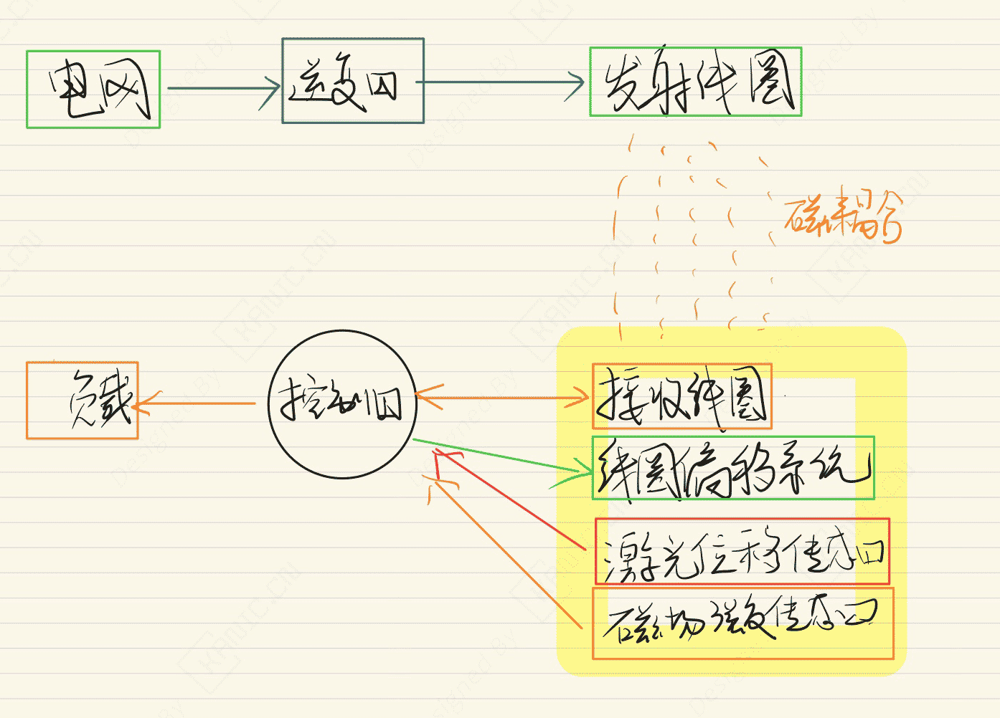
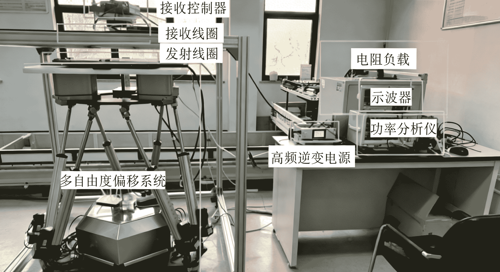

# 3.7 kW 无线电能传输系统-EXP-汽车-无线充电

---

## 实验目的

摘要：

​	本文针对 3.7 kW 无线电能传输系统，重点研究不同发射与接收线圈组合的偏移特性对传输性能的影响。分析输出功率、互感系数及传能效率随偏移变化的规律。测试圆-方形线圈抗偏移性能最佳，为高效无线充电硬件设计与实验实现提供参考。

关键词：**无线电**  **6自由度转台**  **汽车**；偏移特性；线圈类型；Simulink；
> 注：本文仅从实验系统与工程实现角度进行记录。

---

## 实验系统整体结构

下图为根据实验内容整理的系统结构框图。

---

## 关键信号与实验流程说明（精炼版）

- 电网 →  高频逆变 → 发射线圈 →  谐振耦合→  接收线圈→ 控制器→ 负载

> 说明：仅记录信号在系统中的流向与作用，不涉及控制算法或具体参数。

---

## 试验现场

## 说明

> **结构框图来源于实际实验平台验证后的通用实现形式，细节根据具体硬件版本略有差异**。

## 交流说明

>本文首发于【GitHub/Gitee】，作者：KANIC，研究方向为 自动化实验平台、控制算法验证及半实物仿真系统。

相关实验或程序已整理至 GitHub，可在 GitHub 平台搜索 KANIC-lab/KANIC 查看。

如需进一步讨论，可私信联系，并注明文章编号。文章编号位于标题末尾，以字母开头如“EXP-XXXX-XXX”
