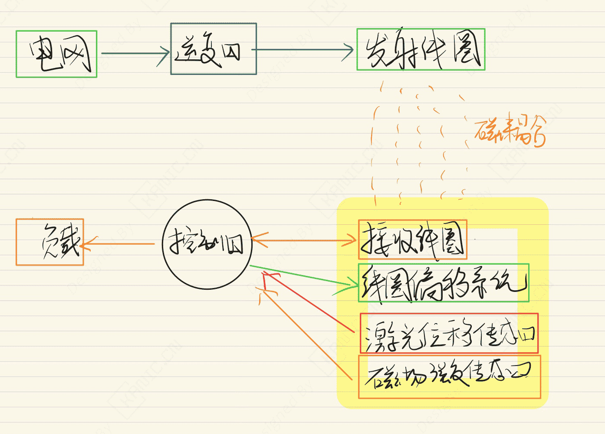
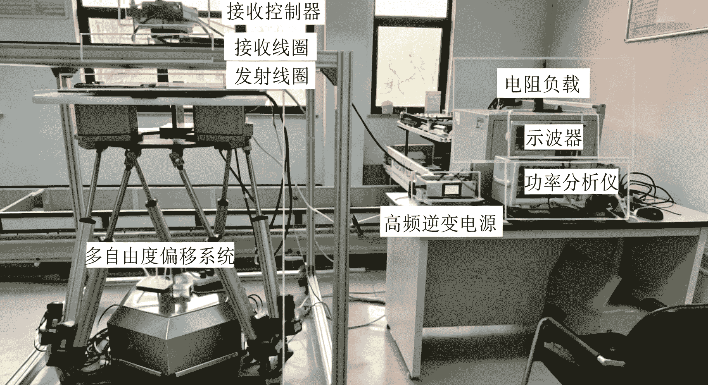

# 3.7 kW 无线电能传输系统-EXP-汽车-无线充电

---

## 实验目的

摘要：

​	本文针对 3.7 kW 无线电能传输系统，重点研究不同发射与接收线圈组合的偏移特性对传输性能的影响。分析输出功率、互感系数及传能效率随偏移变化的规律。测试圆-方形线圈抗偏移性能最佳，为高效无线充电硬件设计与实验实现提供参考。

关键词：**无线电**  **6自由度转台**  **汽车**；偏移特性；线圈类型；Simulink；
> 注：本文仅从实验系统与工程实现角度进行记录。

---

## 实验系统整体结构

下图为根据实验内容整理的系统结构框图。

---

## 关键信号与实验流程说明（精炼版）

- 电网 →  高频逆变 → 发射线圈 →  谐振耦合→  接收线圈→ 控制器→ 负载

> 说明：仅记录信号在系统中的流向与作用，不涉及控制算法或具体参数。

---

## 试验现场

## 说明

> **结构框图来源于实际实验平台验证后的通用实现形式，细节根据具体硬件版本略有差异**。

## 交流说明

>本文相关代码与实验案例已整理至 GitHub（KANIC-lab/KANIC），主要用于自动化控制实验、半实物仿真及控制算法验证。

★ **适用场景：**
- 自动化控制课程实验搭建
- 研究生论文实验验证
- 控制系统与硬件联调测试

◆ **如需获取以下内容：**
- 实验系统配置方案与Simulink配套模板
- 设备租赁与替代方案
- 控制实验快速搭建路径

如果你也在做类似实验，相关设备可以租用，我可以帮你调通——直接私信我

📌 更多同类实验案例，涵盖运动控制、振动控制、液压气动等20个方向
👉 点击查看完整案例目录（https://mp.weixin.qq.com/s/QuxEwVchOgh27426TD7RtA）
