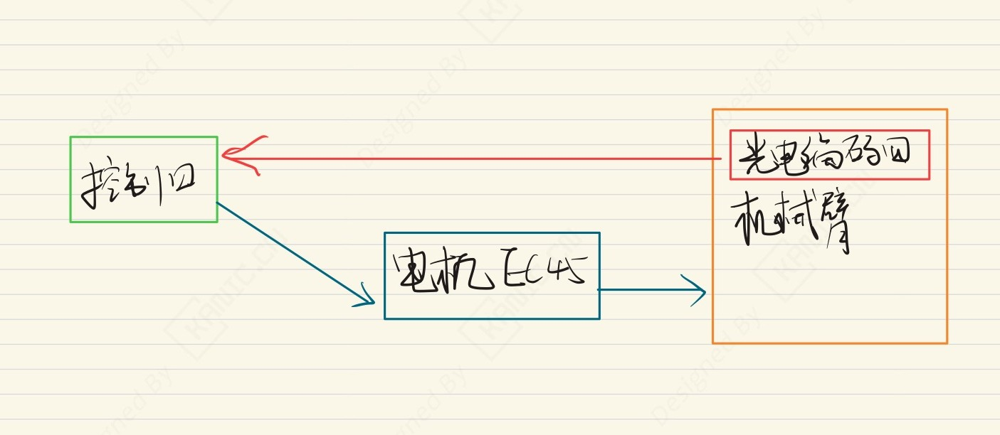
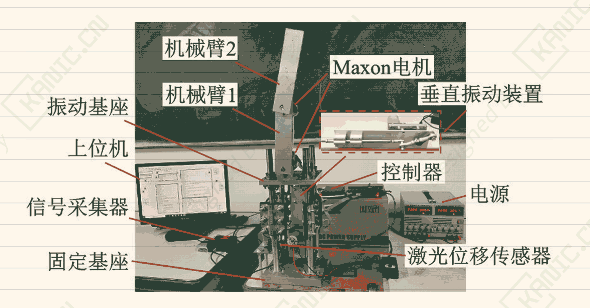

# 振动下机械臂鲁棒快控制-EXP-振动控制-机械臂

---

## 实验目的

摘要：

​	针对基座振动和负载变化的机械臂实验，设计鲁棒有限时间控制器。在两连杆机械臂实验装置上测试，能快速定位目标位置，抗干扰能力强，为控制实现和实验搭建提供参考。

关键词：机械臂； 振动激励； 镇定控制； 负载变化； 隐式Lyapunov函数；Simulink；Maxon EC45；Panasonic HG⁃C1400；Broadcom HEDL-5540
> 注：本文仅从实验系统与工程实现角度进行记录。

---

## 实验系统整体结构

下图为根据实验内容整理的系统结构框图。

---

## 关键信号与实验流程说明（精炼版）

**振动控制闭环**：

- PC → 直流电机（曲柄滑块） → 振动基座 → 激光位移传感器 → PC
   （PC下发振动指令 → 电机驱动曲柄滑块 → 基座产生振动 → 位移传感器测量 → PC采集）

> 说明：仅记录信号在系统中的流向与作用，不涉及控制算法或具体参数。

---

## 试验现场

## 涉及的部分硬件

-  直流无刷电机 **Maxon EC45** 
-  激光位移传感器 Panasonic HG⁃C1400
-  型光电编码器 **Broadcom HEDL-5540 **

> **结构框图来源于实际实验平台验证后的通用实现形式，细节根据具体硬件版本略有差异**。

## 交流说明

>本文首发于【GitHub/Gitee】，作者：KANIC，研究方向为 自动化实验平台、控制算法验证及半实物仿真系统。

相关实验或程序已整理至 GitHub，可在 GitHub 平台搜索 KANIC-lab/KANIC 查看。

如需进一步讨论，可私信联系，并注明文章编号。文章编号位于标题末尾，以字母开头如“EXP-XXXX-XXX”
