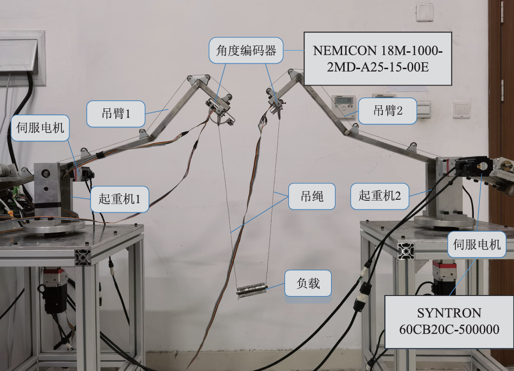

# 双桅杆起重机非线性建模与控制-EXP-整形控制-起重机

---

## 实验目的

摘要：

​	本文介绍了一套双桅杆式起重机实验平台的搭建与实现方法。实现了起重机运动控制、姿态测量与实时反馈。系统结构模块化、硬件接口通用，便于复现与扩展，适合用于复杂起重机系统的实验验证、工程实践及教学演示。

关键词：起重机;非线性欠驱动系统;输入整形控制;消摆控制;前馈控制；Simulink；SYNTRON 60CB20C；NEMICON
> 注：本文仅从实验系统与工程实现角度进行记录。

---

## 实验系统整体结构

下图为根据实验内容整理的系统结构框图。

---

## 关键信号与实验流程说明（精炼版）

- **控制信号：**
    控制器 → 电机驱动器 → 电机 → 起重机
   
   **反馈信号：**
    编码器（摆角 / 俯仰角） → 控制器

> 说明：仅记录信号在系统中的流向与作用，不涉及控制算法或具体参数。

---

## 试验现场

## 涉及的部分硬件

-  伺服电机 **SYNTRON 60CB20C-500000 ** 
-  编码器 **NEMICON 18M-1000-2MD-A25-15-00E **

> **结构框图来源于实际实验平台验证后的通用实现形式，细节根据具体硬件版本略有差异**。

## 交流说明

>本文首发于【GitHub/Gitee】，作者：KANIC，研究方向为 自动化实验平台、控制算法验证及半实物仿真系统。

相关实验或程序已整理至 GitHub，可在 GitHub 平台搜索 KANIC-lab/KANIC 查看。

如需进一步讨论，可私信联系，并注明文章编号。文章编号位于标题末尾，以字母开头如“EXP-XXXX-XXX”
