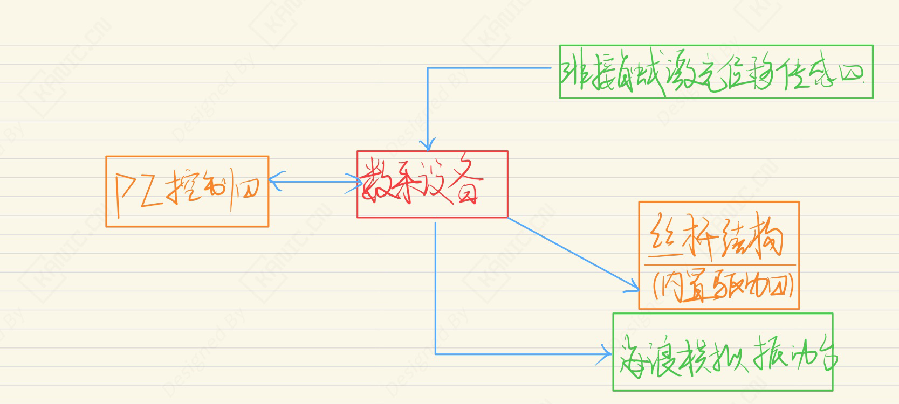

# 模糊 PI 升沉补偿性能优化

## 实验目的

摘要：

针对升沉补偿系统，设计并搭建了一套升沉补偿实验平台。考虑到传统 PI 控制器在复杂海况下适应性不足的问题，提出了一种模糊 PI 控制方法，通过引入模糊控制规则对 PI 参数进行在线自整定，实现控制参数的自适应优化。

实验结果表明，在不同波浪周期和幅值条件下，所设计的模糊 PI 控制器相比传统 PI 控制具有更好的自适应能力、更高的补偿精度以及更优的系统稳定性，能够有效提升升沉补偿系统在复杂工况下的控制性能。

关键字：

- 升沉补偿系统  
- 模糊 PI 控制  
- 参数自整定

> 注：本文仅从实验系统与工程实现角度进行记录。

## 实验系统整体结构

下图为根据实验内容整理的系统结构框图。

---

## 关键信号与实验流程说明

- 六自由度振动台模拟海浪波，推动安装在振动台上面的丝杆结构上下运动。  
- 非接触式激光传感器实时测量丝杆垂直位移  
- 信号经数据采集反馈至 PI 控制器，与期望值比较形成闭环控制，计算补偿方向与速度指令  
- 方向与速度指令驱动丝杆运动，实现升沉补偿

> 说明：仅记录信号在系统中的流向与作用，不涉及控制算法或具体参数。

---

## 实验数据与现场

---

## 说明

> **结构框图来源于实际实验平台验证后的通用实现形式，细节根据具体硬件版本略有差异**。

## 涉及的部分硬件

- 六自由度振动平台 QUANSER Hexapod  
- 伺服驱动与电机 Panasonic MHMD042G1U ，MBDHT2510E
- 激光传感器 Panasonic HG-C1400  

> **以上配置仅用于说明实验背景，不同应用场景下可采用等效方案。**

## 交流说明

>本文首发于【GitHub/Gitee】，作者：KANIC，研究方向为 自动化实验平台、控制算法验证及半实物仿真系统。

相关实验或程序已整理至 GitHub，可在 GitHub 平台搜索 KANIC-lab/KANIC 查看。

如需进一步讨论，可私信联系，并注明文章编号。文章编号位于标题末尾，以字母开头如“EXP-XXXX-XXX”
