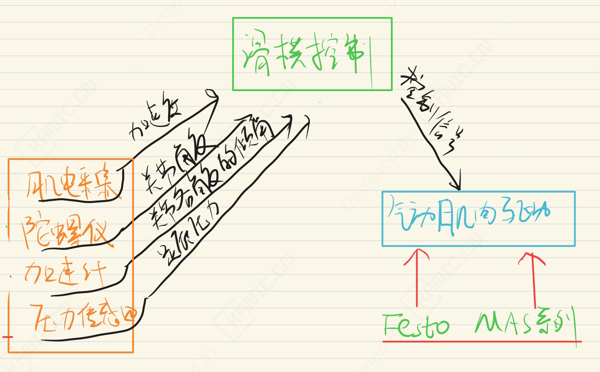
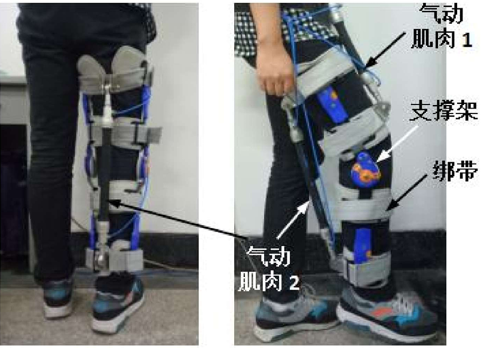

# 肌电信号重构与验证研究-EXP-滑模控制-外骨骼

---

## 实验目的

基于肌电传感器构建半实物仿真系统，实现肌电信号的实时压缩采样与重构，并结合模糊算法与智能分类方法，验证重构信号在不同运动模式下的有效性与工程可用性。  

> 注：本文仅从实验系统与工程实现角度进行记录。

---

## 实验系统整体结构

下图为根据实验内容整理的系统结构框图。

---

## 关键信号与实验流程说明

- 肌电采集模块获取被控对象（下肢外骨骼）加速度  
- 陀螺仪传感器获取获取被控对象（下肢外骨骼）关节角度 
- 加速计传感器获取获取被控对象（下肢外骨骼）关节角度的倾角信号  
- 压力传感器获取获取被控对象（下肢外骨骼）足底压力图谱 
- 滑膜控制信号驱动被控对象（下肢外骨骼）的驱动气动部件执行器（FESTO MAS系列）

> 说明：仅记录信号在系统中的流向与作用，不涉及控制算法或具体参数。

---

## 实验数据与现场

---

## 说明

> **结构框图来源于实际实验平台验证后的通用实现形式，细节根据具体硬件版本略有差异**。

## 涉及的部分硬件

- Delsys Trigno肌电采集系统  
- MPU6050 3轴陀螺仪传感器与3轴加速度传感器
- FSR402/RFP602 电阻式薄膜压力传感器
- Festo MAS 气动驱动装置  

> **以上配置仅用于说明实验背景，不同应用场景下可采用等效方案。**

## 交流说明

本文仅记录一种可复现的实现方式，不同应用场景下会有不同取舍。如果你对其中某个环节（传感器 / 控制算法 / 实验结构）感兴趣， 
欢迎交流不同的实现思路。
