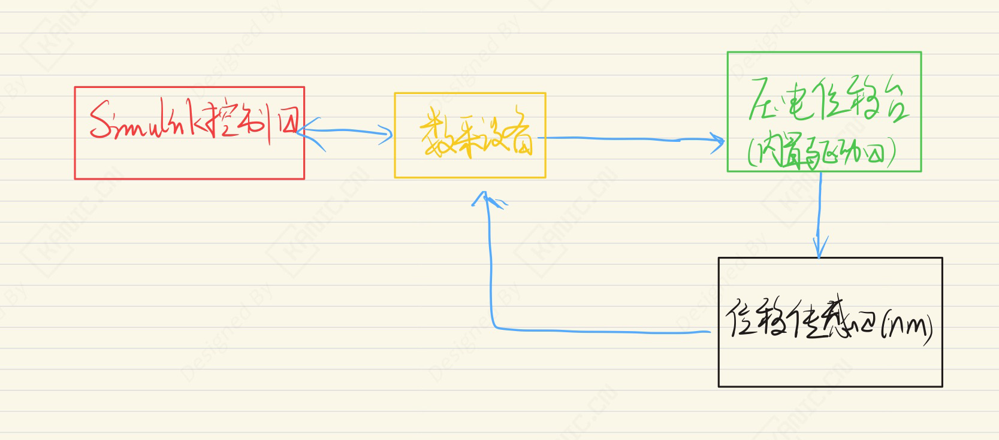
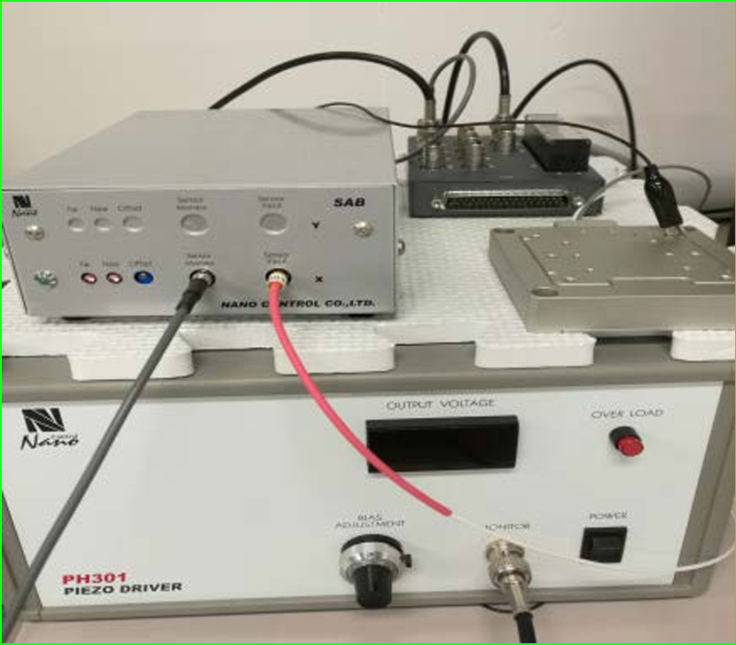

# 压电微定位系统分析-EXP-自动控制-压电微定位

---

## 实验目的

摘要：

针对压电微定位平台系统中存在的复杂输入-输出率相关非线性迟滞问题，本文引入了带有阈值动态调整的 RDPI（Rate-Dependent Prandtl–Ishlinskii）模型。相比传统 PI 模型，该模型能够更准确地描述系统的率相关迟滞特性。

为验证 RDPI 模型的有效性，本文利用非线性最小二乘法对模型参数进行了辨识，并搭建了压电微定位平台实验系统进行实验验证。实验结果表明，在高频及混合频率输入电压条件下，阈值动态调整的 RDPI 模型能够有效表征压电微定位平台的迟滞输入-输出特性

关键词：

- 压电微定位平台  
- 迟滞建模  
- RDPI 模型  
- 率相关  

> 注：本文仅从实验系统与工程实现角度进行记录。

---

## 实验系统整体结构

下图为根据实验内容整理的系统结构框图。

---

## 关键信号与实验流程说明（精炼版）

- 控制器产生控制信号  
- 信号经功率放大器驱动压电移动平台产生位移  
- 位移通过第三方传感器测量校正  
- 信号经柔性铰链放大后反馈给控制器
- 闭环控制实现平滑位移输出

> 说明：仅记录信号在系统中的流向与作用，不涉及控制算法或具体参数。

---

## 实验数据与现场

---

## 说明

> **结构框图来源于实际实验平台验证后的通用实现形式，细节根据具体硬件版本略有差异**。

## 涉及的部分硬件

- 压电位移台 PS1H80-030U  Nano Control
- 压电驱动器 PH301 Nano Control
- 信号发生器 SAB101 Nano Control

> **以上配置仅用于说明实验背景，不同应用场景下可采用等效方案。**

## 交流说明

本文仅记录一种可复现的实现方式，不同应用场景下会有不同取舍。如果你对其中某个环节（传感器 / 控制算法 / 实验结构）感兴趣， 欢迎交流不同的实现思路。
