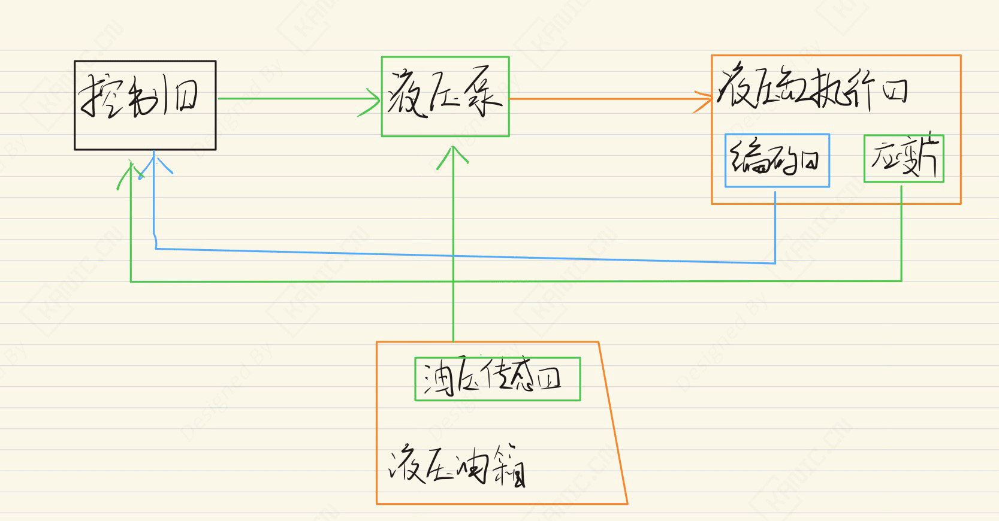
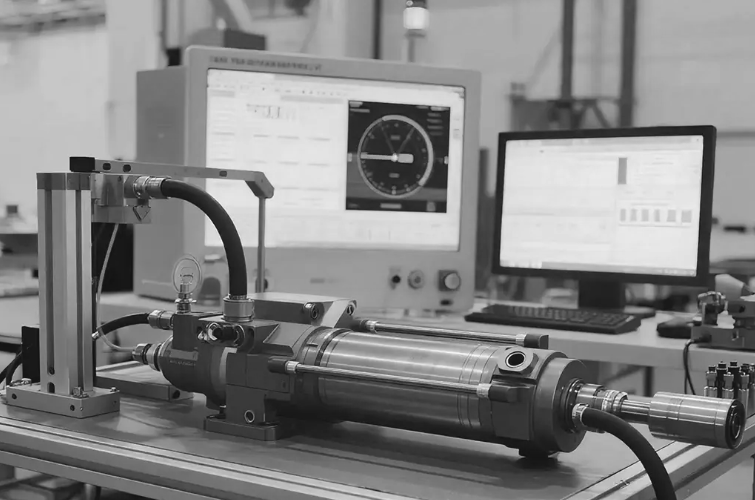

# 不确定性下的电动静液作动器 鲁棒控制-EXP-鲁棒控制-EHA

---

## 实验目的

摘要：

针对 EHA 系统参数不确定性及泄漏、摩擦非线性问题，基于 QFT 设计鲁棒位置控制并引入补偿方法，实验验证了系统跟踪性能的显著提升。

关键词：

- EHA  
- 电动静液作动器  
- 鲁棒控制  
- 静液驱动
- QFT  

> 注：本文仅从实验系统与工程实现角度进行记录。

---

## 实验系统整体结构

下图为根据实验内容整理的系统结构框图。

---

## 关键信号与实验流程说明（精炼版）

- **控制器**发送位置指令给电机。
2. **电机**接收指令并旋转，驱动液压泵。
3. **液压泵**将电机的旋转转化为液压流量和压力。
4. **液压缸（执行器）**接收液压流量产生位移，推动负载。
5. **执行器上的编码器**测量活塞位移，反馈给控制器。
6. **执行器上的压力传感器**测量液压缸内压力，反馈力信息。
7. **Tank（油箱）**储存液压油，缓冲系统压力波动。
8. **油箱压力传感器**监测油液压力，确保系统健康与稳定。

> 说明：仅记录信号在系统中的流向与作用，不涉及控制算法或具体参数。

---

## 实验数据与现场

---

## 说明

> **结构框图来源于实际实验平台验证后的通用实现形式，细节根据具体硬件版本略有差异**。

## 涉及的部分硬件

- **伺服电机** Teknic M-4650
- **液压泵** Parker F11-005
- **液压缸** Parker D1FP
- **编码器** Heidenhain ROD 420
- **液压马达/泵** Parker F11-005
- **液压油箱压力传感器** Honeywell PX3
- **应变片式压力传感器** MeasureX MRA25

> **以上配置仅用于说明实验背景，不同应用场景下可采用等效方案。**

## 交流说明

>本文首发于【GitHub/Gitee】，作者：KANIC，研究方向为 自动化实验平台、控制算法验证及半实物仿真系统。

相关实验或程序已整理至 GitHub，可在 GitHub 平台搜索 KANIC-lab/KANIC 查看。

如需进一步讨论，可私信联系，并注明文章编号。文章编号位于标题末尾，以字母开头如“EXP-XXXX-XXX”
