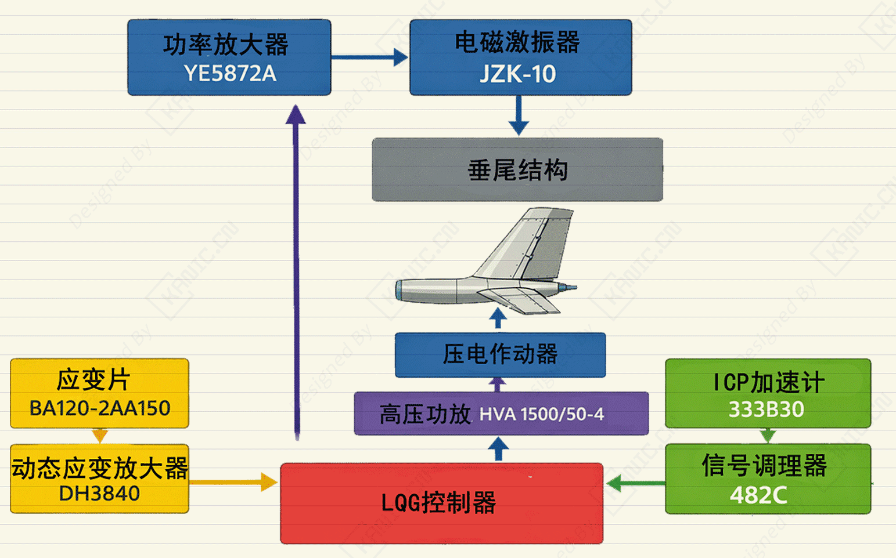

# 垂尾控制升级实验：LQG控制-EXP-LQG-垂尾升级

- ### 1. 系统组成与功能划分

  #### （1）外部激励系统

  - **功率放大器**：YE5872A（Sinocera）
  - **电磁激振器**：JZK-10（Sinocera）
  - **作用对象**：垂尾结构
  - **功能**：向垂尾结构施加外部激励载荷

  #### （2）传感器与信号采集

  - **应变信号采集**
    - 应变片：BA120-2AA150（中电测）
    - 动态应变放大器：DH3840（东华）
  - **加速度信号采集**
    - ICP 型加速度传感器：333B30（PCB）
    - 信号调理器：482C（PCB，用于 ICP–电压转换）

  #### （3）控制系统

  - **仿真平台**：Matlab/Simulink
  - **控制算法**：LQG

  #### （4）执行机构

  - **高压功率放大器**：HVA 1500/50-4（Smart Material）
  - **作动器**：MFC 作动器
  - **功能**：作用于垂尾

  ### 2. 系统框图

  
