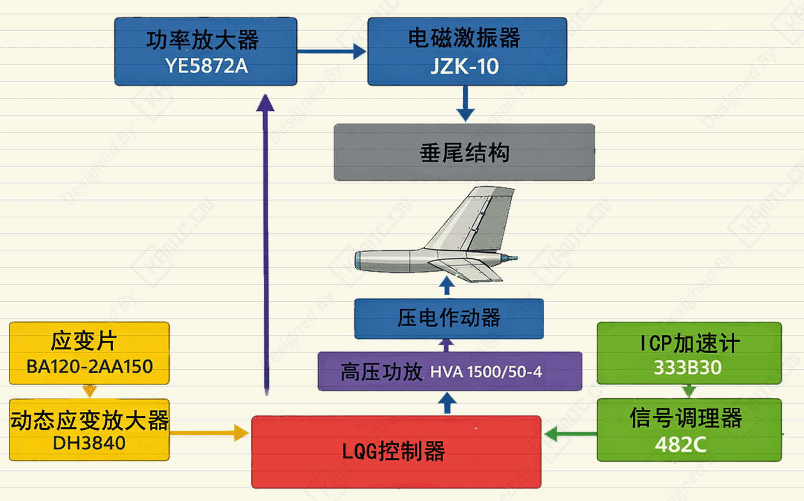

# 垂尾控制升级实验：LQG控制-EXP-LQG-垂尾升级

**关键字**：垂尾抖振 , 主动控制, YE5872A , BA120-2AA150, DH3840 , PCB 33B30, 482C，HVA 1500/50-4，Smart Material

- ### 1. 系统组成与功能划分

  #### （1）外部激励系统

  - **功率放大器**：YE5872A（Sinocera）
  - **电磁激振器**：JZK-10（Sinocera）
  - **作用对象**：垂尾结构
  - **功能**：向垂尾结构施加外部激励载荷

  #### （2）传感器与信号采集

  - **应变信号采集**
    - 应变片：BA120-2AA150（中电测）
    - 动态应变放大器：DH3840（东华）
  - **加速度信号采集**
    - ICP 型加速度传感器：333B30（PCB）
    - 信号调理器：482C（PCB，用于 ICP–电压转换）

  #### （3）控制系统

  - **仿真平台**：Matlab/Simulink
  - **控制算法**：LQG

  #### （4）执行机构

  - **高压功率放大器**：HVA 1500/50-4（Smart Material）
  - **作动器**：MFC 作动器
  - **功能**：作用于垂尾

  ### 2. 系统框图

  

  ### 3. 交流说明

>本文相关代码与实验案例已整理至 GitHub（KANIC-lab/KANIC），主要用于自动化控制实验、半实物仿真及控制算法验证。

★ **适用场景：**

- 自动化控制课程实验搭建
- 研究生论文实验验证
- 控制系统与硬件联调测试

◆ **如需获取以下内容：**
- 实验系统配置方案与Simulink配套模板
- 设备租赁与替代方案
- 控制实验快速搭建路径

如果你也在做类似实验，相关设备可以租用，我可以帮你调通——直接私信我

📌 更多同类实验案例，涵盖运动控制、振动控制、液压气动等20个方向
👉 [点击查看完整案例目录](https://mp.weixin.qq.com/s/QuxEwVchOgh27426TD7RtA)
