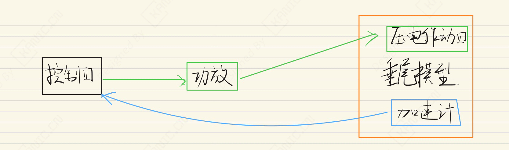
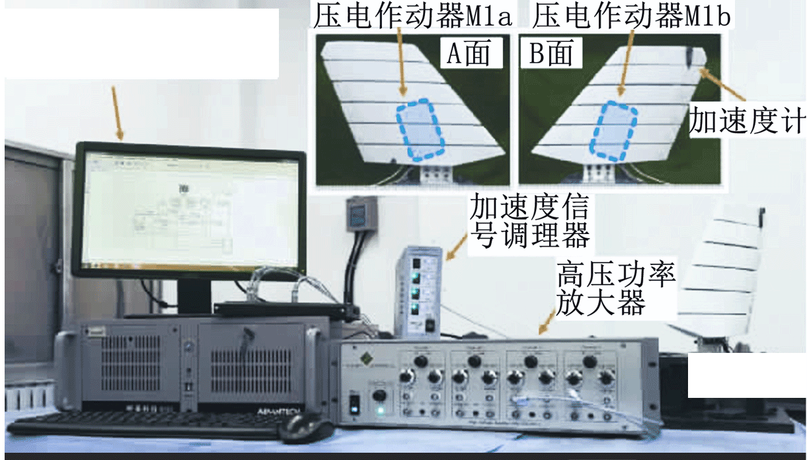

# 鲁棒与自适应的垂尾抖振控制-EXP-振动控制-垂尾

---

## 实验目的

摘要：

对垂尾低阶模态抖振，提出 RFxLMS 多模态控制器，对次级通道实施反馈阻尼补偿，并用宏纤维复合材料压电作动器开展地面与风洞试验。

关键词：

- 垂尾抖振  
- 主动控制  
- FxLMS算法  
- 压电作动器
- 鲁棒控制  

> 注：本文仅从实验系统与工程实现角度进行记录。

---

## 实验系统整体结构

下图为根据实验内容整理的系统结构框图。

---

## 关键信号与实验流程说明（精炼版）

- **控制器**发送位置指令给电机。
2. **电机**接收指令并旋转，驱动液压泵。
3. **液压泵**将电机的旋转转化为液压流量和压力。
4. **液压缸（执行器）**接收液压流量产生位移，推动负载。
5. **执行器上的编码器**测量活塞位移，反馈给控制器。
6. **执行器上的压力传感器**测量液压缸内压力，反馈力信息。
7. **Tank（油箱）**储存液压油，缓冲系统压力波动。
8. **油箱压力传感器**监测油液压力，确保系统健康与稳定。

> 说明：仅记录信号在系统中的流向与作用，不涉及控制算法或具体参数。

---

## 实验数据与现场

---

## 说明

> **结构框图来源于实际实验平台验证后的通用实现形式，细节根据具体硬件版本略有差异**。

## 涉及的部分硬件

- **压电作动器** Smart Material P1 型
- **加速度传感器** PCB 33B30
- **功放** Smart Material **HVA 1500/50-4** 

> **以上配置仅用于说明实验背景，不同应用场景下可采用等效方案。**

## 交流说明

>本文首发于【GitHub/Gitee】，作者：KANIC，研究方向为 自动化实验平台、控制算法验证及半实物仿真系统。

相关实验或程序已整理至 GitHub，可在 GitHub 平台搜索 KANIC-lab/KANIC 查看。

如需进一步讨论，可私信联系，并注明文章编号。文章编号位于标题末尾，以字母开头如“EXP-XXXX-XXX”
