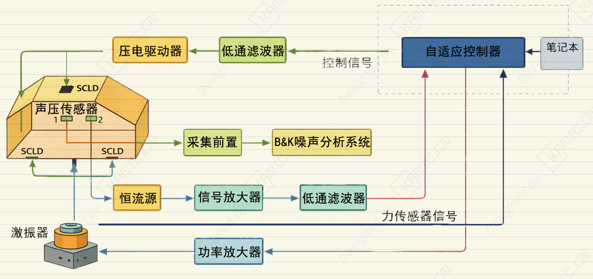

# 升级实验：车身振动噪声主动控制-EXP-振动控制-车身振动

关键词：dSPACE ，智能约束层阻尼，ADF模型，自适应控制，YE3761，B&K 4825，B&K 4101，B&K 2692，HPV-3C0150A0150D

## 控制信号生成
- **电脑**生成控制指令，发送给 **dSPACE 实时半实物仿真平台（DS1005 / Auto Box）**。

## 激励路径 1：电磁激振器（B&K 4825）
1. **dSPACE**输出模拟信号 → **功率放大器** → 提供足够电流驱动激振器。
2. **B&K 4825 激振器**将电信号转换为机械振动，作用于车身结构。

## 激励路径 2：压电作动器
1. **dSPACE**输出低电压控制信号 → **压电驱动电源（HPV-3C0150A0150D）** → 放大信号至压电片工作电压。
2. **压电作动器**产生微小振动，作用于车身。

## 测量与采集路径

### 1. 声压信号
- **1#声压传感器信号（B&K 4101） → **B&K 3560-B-020**数据采集系统** → 噪声分析
- **2#声压传感器信号（B&K 4101） → **SZTL-ICP 恒流源信号调理器→ **B&K 2692 电荷信号放大器** → 滤波（YE3761 低通滤波器） → **电脑**。

### 3. 信号处理
- **6 通道低通滤波器（YE3761）**：滤除高频噪声，保证信号清晰。  
- **dSPACE 平台**接收所有采集信号，用于半实物仿真、闭环控制或数据记录。

