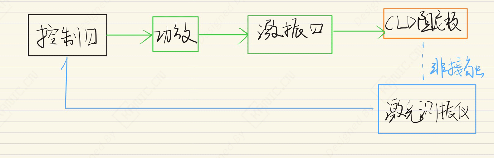
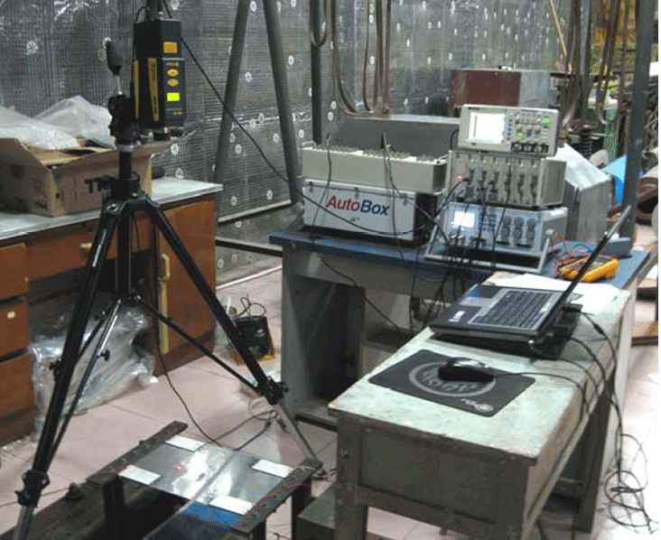

# 智能约束层阻尼振动控制-EXP-振动控制-约束层阻尼板

---

## 实验目的

摘要：

针对智能约束层阻尼（SCLD）结构，建立其动力学模型并利用压电材料实施主动控制。考虑系统非线性、时变及不确定因素，设计自适应控制器提升振动响应性能。基于振动模型分析声辐射特性，为封闭腔体如汽车、飞机、潜艇等内部振动噪声控制提供新思路，实现有效减振降噪。

- 关键词：振动与噪声，智能约束层阻尼，ADF模型，自适应控制，动态神经网络辨识，B&K 4825，B&K 2716，Polytec PDV-100

> 注：本文仅从实验系统与工程实现角度进行记录。

---

## 实验系统整体结构

下图为根据实验内容整理的系统结构框图。

---

## 关键信号与实验流程说明（精炼版）

1. **控制器**  信号输出到外扰激励器。
2. **外扰激励器**  根据信号作用于板结构，产生外扰振动。
3. **功放**  放大控制信号并驱动 SCLD 板结构。
4. **激光测振仪**  测量 SCLD 板结构振动响应。

> 说明：仅记录信号在系统中的流向与作用，不涉及控制算法或具体参数。

---

## 实验数据与现场

---

## 说明

> **结构框图来源于实际实验平台验证后的通用实现形式，细节根据具体硬件版本略有差异**。

## 涉及的部分硬件

- **激振器 B&K 4825** 
- **功放 B&K 2716** 
- **非接触激光测振仪 Polytec PDV-100**

> **以上配置仅用于说明实验背景，不同应用场景下可采用等效方案。**

## 交流说明

>本文首发于【GitHub/Gitee】，作者：KANIC，研究方向为 自动化实验平台、控制算法验证及半实物仿真系统。

相关实验或程序已整理至 GitHub，可在 GitHub 平台搜索 KANIC-lab/KANIC 查看。

如需进一步讨论，可私信联系，并注明文章编号。文章编号位于标题末尾，以字母开头如“EXP-XXXX-XXX”
