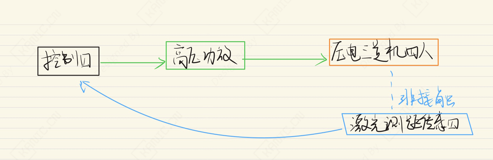
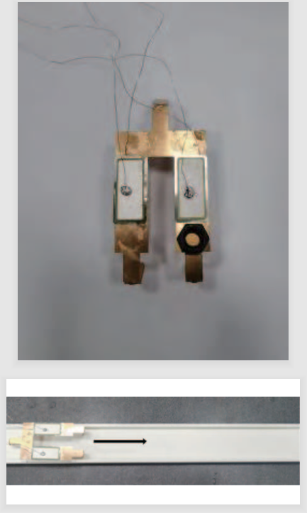

# 三足压电机器人运动分析-EXP-PID控制-压电三足

---

## 实验目的

摘要：

基于压电陶瓷逆压电效应，本文设计了一种三足爬行机器人，采用变截面弯曲梁支撑。通过动力学分析与实验验证，研究了不同驱动频率、弯折角度、负载及电压波形对运动方向和速度的影响，实现左右转和近似直线运动。本研究可为微型爬行机器人设计与实验提供参考。

- 关键词：压电驱动, 微型爬行机器人, 动力学方程, 三足机器人, 变截面梁。

> 注：本文仅从实验系统与工程实现角度进行记录。

---

## 实验系统整体结构

下图为根据实验内容整理的系统结构框图。

---

## 关键信号与实验流程说明（精炼版）

1. **控制器**  信号输出到高压功放。
2. 安泰**高压功放**  驱动被控对象（压电三足机器人）产生指定方向运动。
4. **松下激光测距传感器**  测量轨道被控对象运动位移反馈给控制器。

> 说明：仅记录信号在系统中的流向与作用，不涉及控制算法或具体参数。

---

## 实验数据与现场

---

## 说明

> **结构框图来源于实际实验平台验证后的通用实现形式，细节根据具体硬件版本略有差异**。

## 涉及的部分硬件

- **Panasonic 激光位移传感器 HG-C1030** 
- **高压功放 安泰 ATA 300** 

> **以上配置仅用于说明实验背景，不同应用场景下可采用等效方案。**

## 交流说明

>本文首发于【GitHub/Gitee】，作者：KANIC，研究方向为 自动化实验平台、控制算法验证及半实物仿真系统。

相关实验或程序已整理至 GitHub，可在 GitHub 平台搜索 KANIC-lab/KANIC 查看。

如需进一步讨论，可私信联系，并注明文章编号。文章编号位于标题末尾，以字母开头如“EXP-XXXX-XXX”
