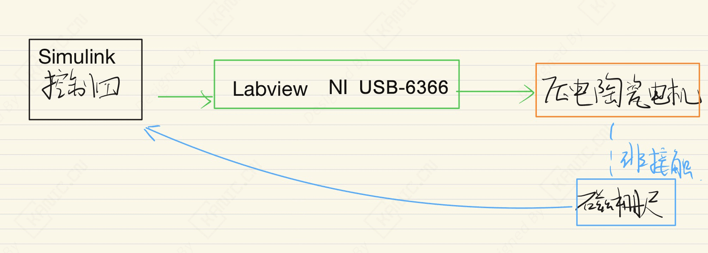
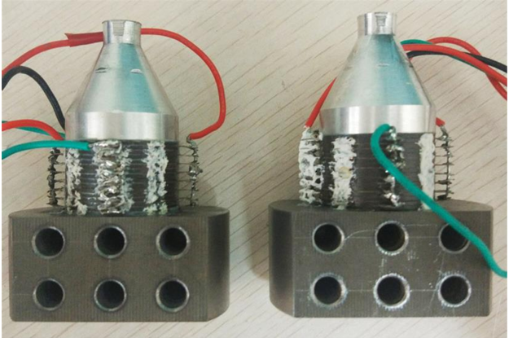

# 压电陶瓷电机直线运动控制-EXP-运动控制-压电陶瓷电机

---

## 实验目的

摘要：

测试压电两自由度直线平台开环速度特性，分析速度随电压与频率变化规律；搭建速度闭环系统，研究低速阶跃与正弦跟踪，为精确运动控制提供参考。

- 关键词：超声电机；直线运动平台；驱动控制系统；速度控制；Simulink Labview联合仿真控制，SIKO MSK200，NI USB-6366，ATA-4051

> 注：本文仅从实验系统与工程实现角度进行记录。

---

## 实验系统整体结构

下图为根据实验内容整理的系统结构框图。

---

## 关键信号与实验流程说明（精炼版）

1. **控制器**  通过Simlink输出信号到Labview 软件中
2. **Labview** 接收到控制信号（频率和相位）驱动NI USB-6366。
3. **高压功放**  驱动被控对象（压电陶瓷电机）产生运动。
4. **磁栅尺**  测量被控对象（压电陶瓷电机）位移。

> 说明：仅记录信号在系统中的流向与作用，不涉及控制算法或具体参数。

---

## 实验数据与现场

---

## 说明

> **结构框图来源于实际实验平台验证后的通用实现形式，细节根据具体硬件版本略有差异**。

## 涉及的部分硬件

- **SIKO MSK200 测量指向位移** 
- **安泰 ATA-4051 高压功放驱动电机** 
- **NI USB-6366 产生符合频率和相位的信号**
- **Labview 接收 Simulink控制器信号**

> **以上配置仅用于说明实验背景，不同应用场景下可采用等效方案。**

## 交流说明

>本文相关代码与实验案例已整理至 GitHub（KANIC-lab/KANIC），主要用于自动化控制实验、半实物仿真及控制算法验证。

★ **适用场景：**
- 自动化控制课程实验搭建
- 研究生论文实验验证
- 控制系统与硬件联调测试

◆ **如需获取以下内容：**
- 实验系统配置方案
- 设备租赁与替代方案
- 控制实验快速搭建路径

请通过 GitHub 或文章编号（如 EXP-XXXX-XXX）联系，并说明具体实验需求。
