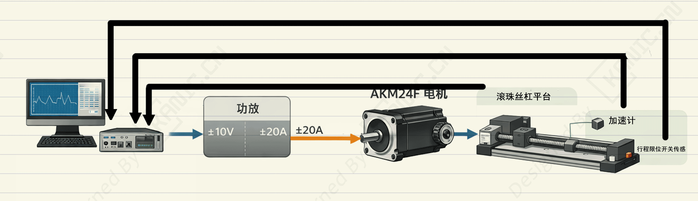

# AKM24F无刷电机实现精确线性运动-EXP-振动台-三相电机

---

## 实验目的

摘要：

本振动台实验系统通过上位机（DAQ）控制功放驱动AKM24F无刷电机，实现滚珠丝杠平台的精确线性位移。电机内部编码器提供实时位移反馈，加速度计监测运动状态，限位开关保证行程安全。通过闭环控制，上位机可精确调节电机电流，实现实验中高精度位移与加速度测量。

- 关键词：Kollmorgen AKM24F；滚珠丝杠平台；三相无刷电机；振动控制；Simulink 仿真控制，Omron EE-SPY415，ADXL325，加速计

> 注：本文仅从实验系统与工程实现角度进行记录。

---

## 实验系统整体结构

下图为根据实验内容整理的系统结构框图。

---

## 关键信号与实验流程说明（精炼版）

**上位机（Simulink + DAQ）**

- 生成控制信号 ±10V（对应 ±20 A 输出）
- 接收编码器、加速度计、限位开关反馈

**功放 **

- 接收 ±10V 控制信号
- 输出对应电流给 Kollmorgen AKM24F 电机
- 内部用 DC 母线 + PWM 桥生成电流

**电机 + 编码器**

- 电机按电流产生转矩，驱动滚珠丝杠（1英寸）旋转
- 编码器检测旋转角度 → 转换为直线位移

**滚珠丝杠平台**

- 转换旋转为直线位移
- 安装加速度计 → 测平台加速度
- 限位开关 → 检测到行程端点

**反馈闭环**

- 上位机接收编码器位移、加速度、限位开关状态
- 调整输出信号 → 功放 → 电机

---

## 实验数据与现场

---

## 说明

> **结构框图来源于实际实验平台验证后的通用实现形式，细节根据具体硬件版本略有差异**。

## 涉及的部分硬件

- **Kollmorgen AKM24F 三相无刷电机** 
- **ADXL325 加速度模块** 
- **Omron EE-SPY415 行程限位开关**

> **以上配置仅用于说明实验背景，不同应用场景下可采用等效方案。**

## 交流说明

>本文首发于【GitHub/Gitee】，作者：KANIC，研究方向为 自动化实验平台、控制算法验证及半实物仿真系统。

相关实验或程序已整理至 GitHub，可在 GitHub 平台搜索 KANIC-lab/KANIC 查看。

如需进一步讨论，可私信联系，并注明文章编号。文章编号位于标题末尾，以字母开头如“EXP-XXXX-XXX”
