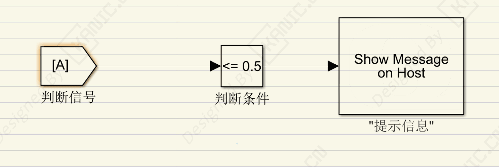

# 控制信号提示：程序调试救命技巧-PART-信号-提示

## 关键词
simulink、变量提示、程序调试、自动化实验

---

## 问题场景
在实验中，学生经常遇到程序跑不起来，但不知道原因。  
**案例**：有一次用户做Simulink自动控制实验，A模块一直不运行，他以为硬件坏了，查了半天没发现问题。后来才发现，是程序里关键变量没设计好，程序在某一步卡住了，但没有任何提示，导致他无法定位。

---

## 解决方法
- **关键变量提示**：每个重要信号/变量加日志或界面提示，让运行状态一目了然。  

- **异常停机**：遇异常立即停止程序并提示，快速找出问题环节。  

- **流程可视化**：简单标记显示程序执行模块，帮助理解流程。  

- **自主排查**：通过提示信息，学生可以自己定位问题，提升分析能力。

  

---

## 小结
- 变量提示 = 程序运行可视化  
- 异常停机 = 快速定位问题  
- 简单可视化 = 避免误判硬件问题  

---

- ## 🔑 说明

  1. >本文首发于【GitHub/Gitee】，作者：KANIC，研究方向为 自动化实验平台、控制算法验证及半实物仿真系统。

     相关实验或程序已整理至 GitHub，可在 GitHub 平台搜索 KANIC-lab/KANIC 查看。

     如需进一步讨论，可私信联系，并注明文章编号。文章编号位于标题末尾，以字母开头如“EXP-XXXX-XXX”
