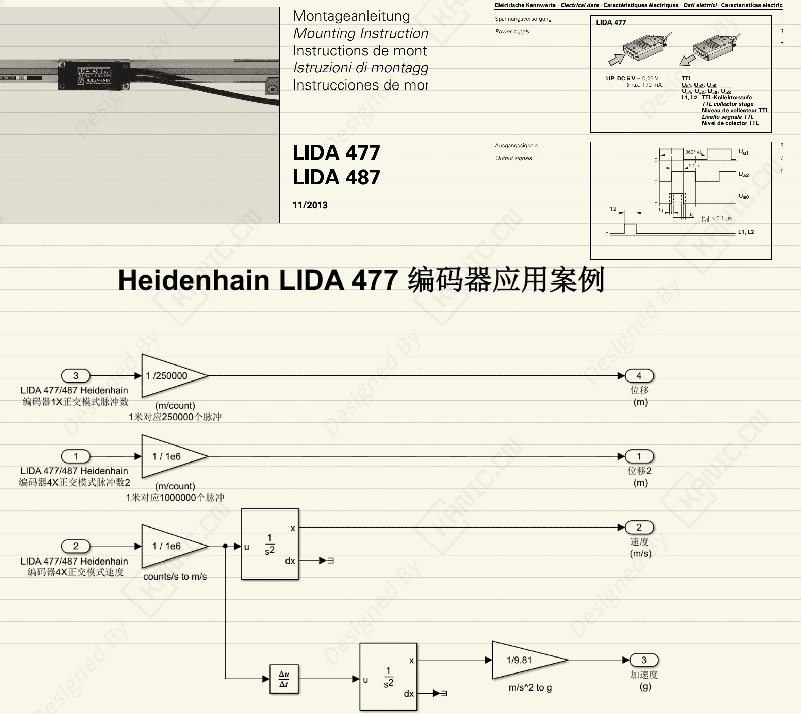

# LIDA 477 编码器位移/速度/加速度采集与转换-PART-LIDA 477-采集转换

**关键字：**LIDA 477、Hidenhain、磁姗尺、编码器、位移、速度、加速度、Simulink、半实物

## 一、问题分析

在半实物仿真实验中，我们常用编码器或磁栅尺来采集位移信息。近期在使用 **LIDA477 磁栅尺**时，遇到以下问题：

1. **脉冲倍率理解混乱**  
   LIDA477 在1X倍频正交模式下 1 米对应 25 万脉冲，但在 2 倍/4 倍频模式下，脉冲数分别变为 50 万 / 100 万。用户容易误算位移和速度。

2. **速度与加速度单位换算**  
   编码器硬件设备读取速度单位为 m/脉冲，但加速度需要从微分速度得到，单位初始是 m/s²，或需要转换为 g。

3. **噪声干扰**  
   高频噪声导致速度读数抖动，直接微分会放大噪声，影响加速度计算。

如果不处理好这些问题，实验数据容易出现漂移、异常跳变，导致仿真控制结果失真。

---

## 二、处理方法

---

### 4. 实验步骤示意

1. 读取编码器脉冲 → 乘以倍率 → 转换为位移  
2. 速度采集 → 数字滤波 → 输出滤波速度  
3. 速度微分 → 得到加速度 → 单位换算成 g  

---

## 三、经验边界 / 小结

- **经验提示**：
  1. 选择合适的倍频模式，不要盲目用高倍频，硬件读取能力有限，高倍频增加噪声敏感度。  
  2. 滤波参数要结合实验频率响应，避免过度平滑导致动态特性丢失。  
  3. 加速度计算先为先微分后滤波，否则噪声会被放大。

---

## 四、🔑 说明

1. >本文首发于【GitHub/Gitee】，作者：KANIC，研究方向为 自动化实验平台、控制算法验证及半实物仿真系统。

   相关实验或程序已整理至 GitHub，可在 GitHub 平台搜索 KANIC-lab/KANIC 查看。

   如需进一步讨论，可私信联系，并注明文章编号。文章编号位于标题末尾，以字母开头如“EXP-XXXX-XXX”

