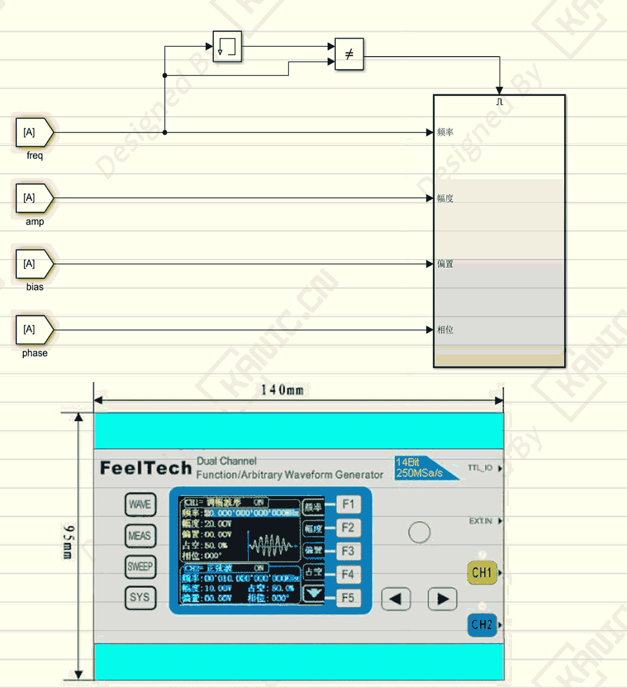

# Simulink：FY2300 信号源怎么控-PART-FeelTech-RS232

**关键词：**RS232、Simulink、串口协议、信号源控制、FY2300、仪器通信

## 技术场景
高校自动化实验中，需要在 MATLAB / Simulink 中控制 FY2300 信号源输出指定频率、幅值、相位，通过 RS232 串口与上位机通信，驱动压电陶瓷电机或其他设备。

## 遇到的问题
- FY2300 使用厂商定制串口协议，数据格式、命令结构、结束符必须严格遵守  
- Simulink 默认串口模块只能发送字节，不能自动拼接协议  
- 直接发送数据导致设备无响应或参数错乱，调试耗时长  

## 工程分析
问题不在控制算法，而在**通信接口工程**：  
- 信号源是指令型设备，需要严格遵守协议  
- Simulink 需要先处理协议封装，再发指令  

## 解决方法
1. 使用串口调试工具验证 FY2300 协议，确保每条命令有正确响应  
2. 在 Simulink 封装协议模块：  
   - 输入：频率 / 幅值 / 相位  
   - 内部：数值 → 字符串 → 拼协议 → RS232 发送  
   - 输出：设备状态 / 执行确认  
3. 该模块可复用到其他 RS232 传感器或执行器  

## 经验提示
- 遇到设备控制异常，先确认协议和接口，而不是盲目改控制算法  
- 模块化封装协议可大幅降低调试时间，提高实验稳定性  

## 🔑 说明

1. >本文首发于【GitHub/Gitee】，作者：KANIC，研究方向为 自动化实验平台、控制算法验证及半实物仿真系统。

   相关实验或程序已整理至 GitHub，可在 GitHub 平台搜索 KANIC-lab/KANIC 查看。

   如需进一步讨论，可私信联系，并注明文章编号。文章编号位于标题末尾，以字母开头如“EXP-XXXX-XXX”

