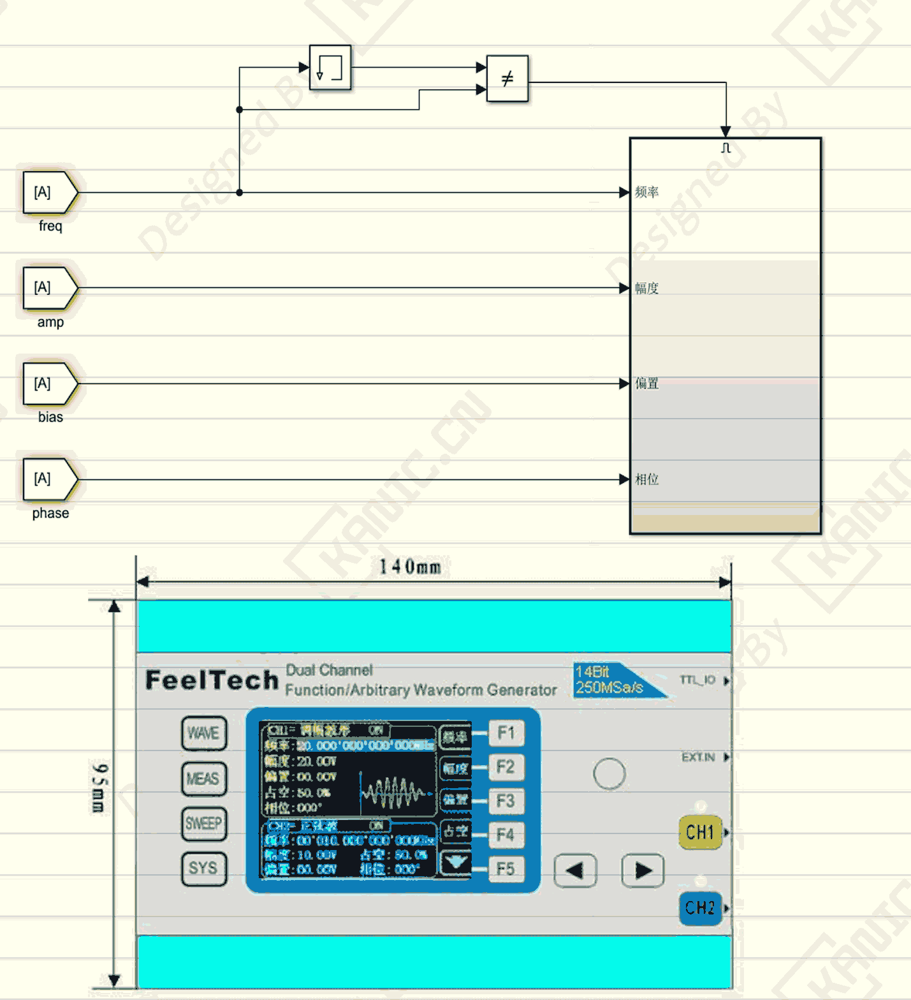

# Simulink：FY2300 信号源怎么控-PART-FeelTech-RS232

**关键词：**RS232、Simulink、串口协议、信号源控制、FY2300、仪器通信

## 技术场景
高校自动化实验中，需要在 MATLAB / Simulink 中控制 FY2300 信号源输出指定频率、幅值、相位，通过 RS232 串口与上位机通信，驱动压电陶瓷电机或其他设备。

## 遇到的问题
- FY2300 使用厂商定制串口协议，数据格式、命令结构、结束符必须严格遵守  
- Simulink 默认串口模块只能发送字节，不能自动拼接协议  
- 直接发送数据导致设备无响应或参数错乱，调试耗时长  

## 工程分析
问题不在控制算法，而在**通信接口工程**：  
- 信号源是指令型设备，需要严格遵守协议  
- Simulink 需要先处理协议封装，再发指令  

## 解决方法
1. 使用串口调试工具验证 FY2300 协议，确保每条命令有正确响应  
2. 在 Simulink 封装协议模块：  
   - 输入：频率 / 幅值 / 相位  
   - 内部：数值 → 字符串 → 拼协议 → RS232 发送  
   - 输出：设备状态 / 执行确认  
3. 该模块可复用到其他 RS232 传感器或执行器  

## 经验提示
- 遇到设备控制异常，先确认协议和接口，而不是盲目改控制算法  
- 模块化封装协议可大幅降低调试时间，提高实验稳定性  

## 🔑 说明

>本文相关代码与实验案例已整理至 GitHub（KANIC-lab/KANIC），主要用于自动化控制实验、半实物仿真及控制算法验证。

★ 适用场景：
\- 自动化控制课程实验搭建
\- 研究生论文实验验证
\- 控制系统与硬件联调测试

◆ 如需获取以下内容：
\- 实验系统配置方案
\- 设备租赁与替代方案
\- 控制实验快速搭建路径

请通过 GitHub 或文章编号（如 EXP-XXXX-XXX）联系，并说明具体实验需求。
