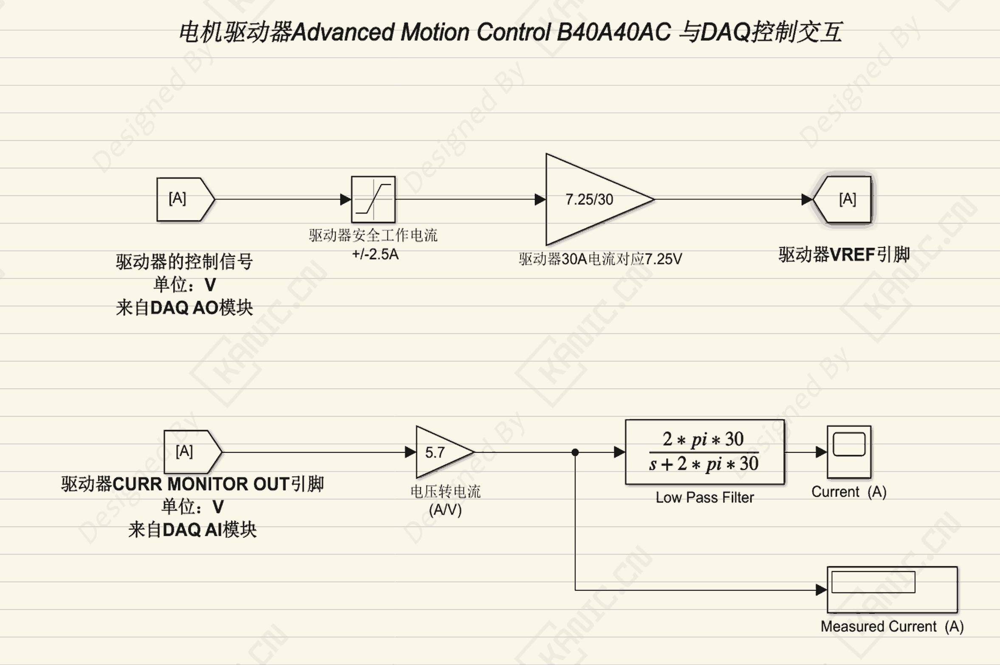

# 三相无刷交流电机Simulink闭环控制-PART-三相无刷电机-VA解析

关键词：AMC B40A40AC simulink 三相无刷交流电机

## 一、问题分析

在高校或工程自动化实验中，经常会遇到**三相无刷交流电机**或类似电机的控制问题。

典型难点包括：  
- 电机需要通过驱动器控制，初学者往往不清楚信号如何连接和对应  
- Simulink控制器发送的电压信号与驱动器电流的对应关系不明确  
- 控制信号过大可能导致驱动器或电机损坏  
- 电流监测和反馈环节未正确接入，难以实现准确的速度或位置控制

**案例背景**：  

- 电机类型：三相无刷交流电机  
- 驱动器规格：峰值电流 30A，控制电压最大 7.25V  
- 控制方式：Simulink发送电压信号控制驱动器  
- 环境特点：实验台上，存在复杂负载或干扰

---

## 二、处理思路与解决方案

1. **建立电压-电流对应关系**  
   - 驱动器最大峰值 30A 对应控制电压 7.25V  
   - 根据实际输出电压计算电流：每 1V ≈ 5.7A

2. **控制信号限幅**  
   - Simulink中添加限幅器（Saturation）  
   - 防止发送超出驱动器最大电压的指令，避免损坏电机或驱动器

3. **电流监测接入**  
   - 驱动器提供电流监测端口，输出电压信号  
   - 将信号接入Simulink，实现位置或速度控制的反馈环

4. **滤波器处理（可选）**  
   - 在复杂环境下增加低通滤波器  
   - 降低控制信号噪声，提高控制稳定性

5. **Simulink程序设计思路**  

  控制器 → 限幅器 → 驱动器输入
 电流输出 → 电流转换 → 控制器反馈

---

## 三、经验小结
- 核心：电压-电流对应 + 限幅 + 闭环反馈  
- 注意：参数明确、信号安全、环境干扰时加滤波  

**提示**：遇到控制不稳或接线复杂问题，可提供Simulink调试及电流反馈方案，快速安全实现电机控制。  

---

## 四、标题备选
1. **问题型**：三相无刷交流电机在Simulink控制下易损驱动器？  
2. **干货型**：Simulink限幅+电流监测控制三相无刷交流电机  
3. **案例型**：高校实验：电流反馈驱动三相无刷交流电机  
4. **极简型**：三相无刷交流电机 + Simulink闭环控制

