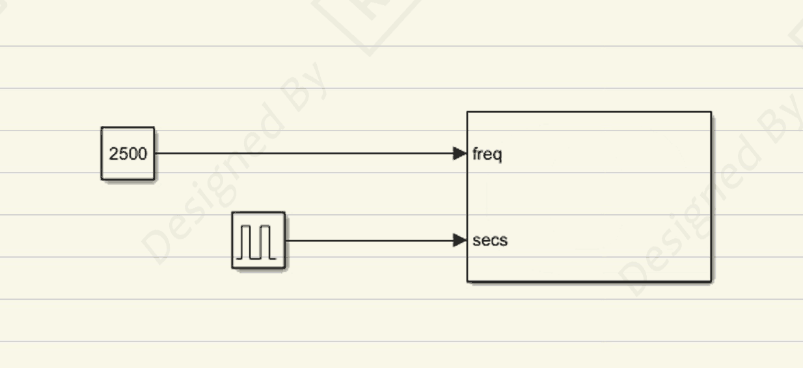
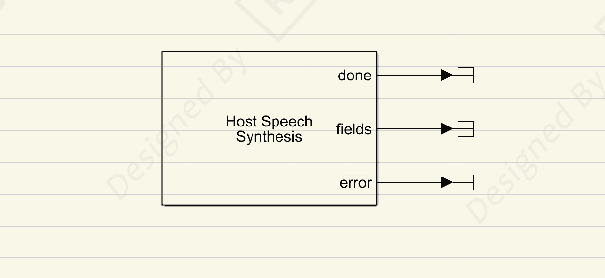

# Simulink 程序状态声音提示方案-PART-蜂鸣-程序提示

> 适用场景：高校自动化实验、工程控制仿真、远程实验监控  
> 核心关键词：Simulink、程序状态监控、声音提示、蓝牙远程提示

---

## 一、问题分析

在高校自动化实验或工程控制中，运行 Simulink 程序时，通常需要**全程/间接盯着电脑屏幕**，观察程序状态或完成情况。这带来了以下问题：

- **操作疲劳**：长时间盯屏容易眼睛疲劳和注意力下降  
- **效率低下**：无法同时进行其他实验或辅助工作  
- **远程受限**：实验室人员无法同时监控多个实验或远程实验  

> 特别在多通道控制、长时间采集或复杂仿真实验中，这种问题尤为明显。

---

## 二、方法/处理方案

针对上述问题，我们在 Simulink 中设计了状态声音提示模块：

1. **程序状态触发器**

   - 在 Simulink 模型中添加状态检测模块，监控关键运行状态（如仿真完成、中间状态变化）。

2. **电脑蜂鸣器提示输出**

   - 当程序达到指定状态时，通过电脑扬声器触发声音提示。

   

3. **电脑语音提示输出**

   - 可实现远程监听，无需盯屏，轻松掌握程序状态（如 Model Start、Attention，Stop 等用户指定文本词汇）。

     

4. **蓝牙扩展（可选）**

   - 用户佩戴蓝牙耳机时，配对（运行程序的）主机后远程听到实验状态提示  
   - 实现“远程监听”，无需盯屏，解放双手

5. **多场景适用**

   - 支持台式机、笔记本或远程实验控制环境

> **小技巧**：不同状态可以对应不同音色或频率，快速识别实验进度。

---

## 三、 小结

**优势**：

- 解放用户双手，提高实验效率  
- 支持远程实验监听  
- 可与多通道、多任务实验结合  

**适用场景**：

- 长时间运行程序  
- 需要远程监控状态  
- 学生或教师同时处理多任务实验  

**限制**：

- 蓝牙覆盖范围有限  
- 声音提示无法完全替代屏幕数据的详细监控  
- 多程序并行监控需要额外逻辑处理

---

## 四、🔑 说明

1. >本文首发于【GitHub/Gitee】，作者：KANIC，研究方向为 自动化实验平台、控制算法验证及半实物仿真系统。

   相关实验或程序已整理至 GitHub，可在 GitHub 平台搜索 KANIC-lab/KANIC 查看。

   如需进一步讨论，可私信联系，并注明文章编号。文章编号位于标题末尾，以字母开头如“EXP-XXXX-XXX”

