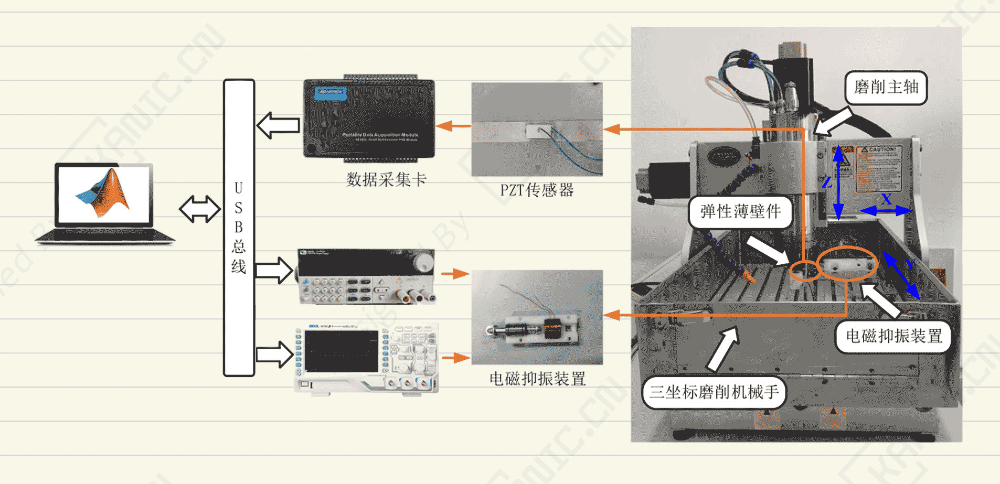

# 电子抑振控制实验中MATLAB+示波器的用法-PART-RIGOL-电磁制振


> 关键词：`电子抑振` `MATLAB` `示波器` `振动控制` `RIGOL DS1102ZE`

## 背景（技术场景）
在电子抑制振动（Electronic Vibration Suppression，电子抑振）实验中，
需要同时完成两件事：

- MATLAB / Simulink 实现抑振控制算法  
- 示波器实时观测抑振装置的电信号与动态响应  

关键点在于：**示波器不是旁观者，而是实验系统的一部分**。



---

## 常见翻车点（问题）
很多实验一开始就卡在这里：

- 示波器只能“看波形”，无法参与实验流程  
- MATLAB 与示波器通信不稳定（采样、触发不同步）  
- 波形看似变好了，但无法证明是“控制生效”  

本质问题不是算法，而是**控制系统与测量系统没有形成闭环**。

---

## 可行思路（工程解法）
实践中更稳妥的做法是：

- 把示波器当作**受控设备**，由 MATLAB 统一配置  
- 明确三条信号链路：  
  - 控制：MATLAB → 抑振装置  
  - 测量：抑振装置 → 示波器  
  - 验证：示波器 → MATLAB / 离线分析  
- 优先基于成熟实例，而不是从零硬试

## 示波器配置示例（RIGOL + MATLAB）
以下是实验中使用的示波器基础配置，
通过 VISA / TCPIP 由 MATLAB 发送 SCPI 指令完成。

```matlab
%------------ 示波器配置信息 ------------%
% 打开 RIGOL 配套软件 Ultra Sigma

% 获取 RIGOL 示波器地址
% TCPIP::169.254.72.202::INSTR

% 逐个参数设置：
% 设置水平时间尺度为 0.1 s/div
:TIM:SCAL 0.1

% 设置 CH1 垂直量程
:CHAN1:RANG 2e+01

% 设置边沿触发电平为 0.5 V
:TRIG:EDG:LEV 0.5

% 一次性参数设置（推荐）
TIM:SCAL 0.1;:CHAN1:RANG 2e+01;:TRIG:EDG:LEV 0.5;
%------------ 配置结束 ------------%
```

---

## 经验小结
> 能看到波形 ≠ 实验是对的  

电子抑振实验是否“站得住”，取决于：
**数据是否可复现、过程是否可解释、结论是否可信**。

MATLAB + 示波器的正确联动，
是从“演示”迈向“工程实验”的分水岭。

---

## 🔑 说明

1. >本文首发于【GitHub/Gitee】，作者：KANIC，研究方向为 自动化实验平台、控制算法验证及半实物仿真系统。

   相关实验或程序已整理至 GitHub，可在 GitHub 平台搜索 KANIC-lab/KANIC 查看。

   如需进一步讨论，可私信联系，并注明文章编号。文章编号位于标题末尾，以字母开头如“EXP-XXXX-XXX”
