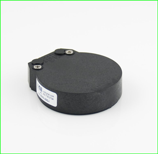
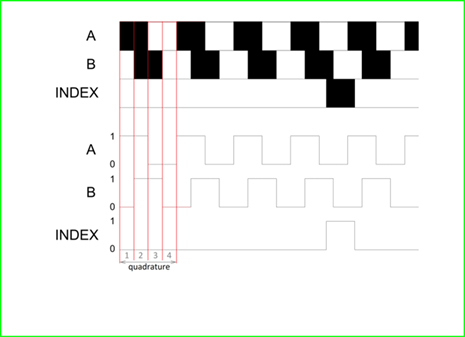
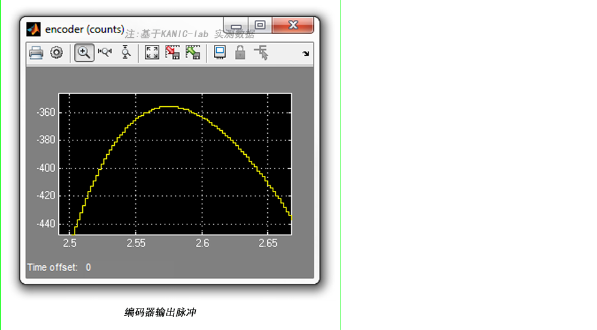
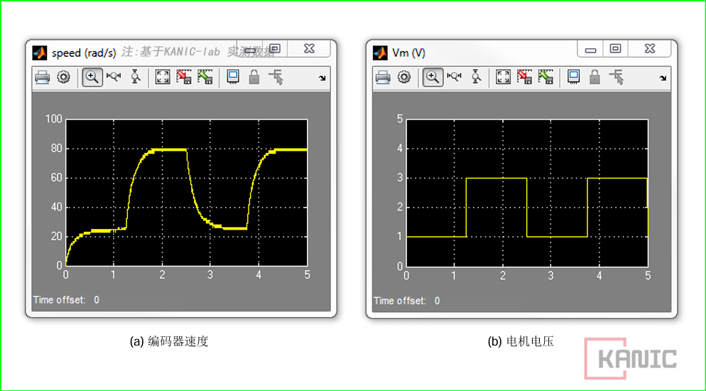

# 【编码器信号】滤波前后差别你必须知道

##  编码器简介

编码器可以测量角位置和速度。类型很多，但最常用的是**旋转增量光电编码器**（如图 1.1 所示），本文使用型号为 **US Digital E3** 的编码器。

与电位器不同，编码器测量的是**相对位置**，其角度依赖于前一位置和上一次上电时的位置。编码器内部包含一个编码盘和多个径向光栅。该盘与直流电机轴相连，当轴旋转时，一束 LED 光束穿过光栅，并由光电传感器接收，从而生成 **A 信号** 和 **B 信号**（如图 1.2 所示）。

编码盘每旋转一圈，会触发一个索引脉冲信号，该信号可用于**标定或系统回零**。电机轴旋转时产生的 A、B 信号，通过解码算法生成计数值。

编码器的分辨率由编码盘线数和解码方式决定。例如，一只 512 线编码器在轴旋转一周时生成 512 个计数值。然而，在四倍频解码器模式下（如图 1.2 所示），每转计数值可达到 2048。其原理在于 A 相与 B 相的相位偏移：在每个脉冲周期内，可产生多种开/关状态，使编码器能够检测旋转方向，因为顺时针与逆时针旋转时开/关状态出现的顺序不同。

> **图 1.1** 旋转增量光电编码器示意  
>
> 
>
> ​								**图 1.2** A/B 相信号与索引脉冲示意

---

## 编码器连接到 Simulink 后的首要任务

在使用 Simulink 读取编码器信号之前，首先需要测量每转的总计数值。操作步骤如下：

1. 停止 Simulink 中的 **编码器读取控制器**  
2. 将圆盘旋转到被控对象标识的 0° 位置  
3. 重新启动 **编码器读取控制器**，旋转被控对象一整圈

编码器计数值应接近 2048，与 US Digital E3 编码器手册一致。  

- 编码器分辨率：512 线/转  
- 四倍频模式计数值：4 × 512 = 2048  

---

##  从编码器计数值计算旋转角度

每转对应计数值为 2048。将计数转换为角度的增益为：

**增益 = 360° / 2048 counts ≈ 0.1748° / count**

**验证步骤**：

- 将圆盘转动到 0° 位置  
- 启动 Simulink **编码器读取控制器**  
- 将圆盘旋转一整圈，确认输出值为 360°  

---

## 从编码器计数值计算旋转弧度

若需测量旋转弧度，可将增益设置为：

**增益 = 2π / 2048  (单位：rad)**

注意：此处使用弧度而非角度。  

---

## 被控对象旋转速度测量（编码器速度测量）

要测量旋转速度，可将 **Derivative 模块** 连接到编码器标定增益输出，实现速度计算（单位：rad/s）。

**示例操作**：

- 给被控对象电机施加一个 1V~3V 的阶跃电压，频率 0.4 Hz  

- 通过编码器观察速度响应，如下图所示：

  

---

##  编码器应用经验：旋转测量与直线位移

除了本文主要介绍的旋转增量光电编码器，实际实验和工程中还会遇到其他类型的编码器。下面分享一些应用经验，供用户参考：

- **旋转编码器（Rotary Encoder）**  
  - Omron E6B2  
  - 该型号经过实际测试，在旋转角度和速度测量中表现稳定可靠，适用于实验和小型控制系统。  
  - 应用场景：精确测量电机旋转角度、速度反馈。  
- **直线编码器（Linear Encoder）**  
  - SIKO MSK200 + MB200（磁性传感器 / 磁条型）  
  - 在直线位移测量中被用户多次采用，并提供过技术支持，效果良好。  
  - 应用场景：自动化实验平台、直线运动测量、实验数据采集。  

##  编码器速度信号噪声及滤波

编码器的本质输出是**脉冲信号**。在实验中，这些脉冲首先被换算为**角位移（弧度）**，再对弧度信号进行微分，得到**角速度（rad/s）**，也就是我们在控制系统中真正需要的“速度量”。

---

## 噪声产生原因

微分运算会显著放大噪声。

以一只 2048 线的增量式编码器为例，每转一圈输出 2048 个离散阶跃信号，每个阶跃对应的角度为：

也就是说，编码器输出的并不是连续的角度变化，而是**阶跃型离散信号**。对这种信号进行微分时，本质上是在对大量不连续点做运算，结果必然表现为**高频噪声严重的速度波形**。

此外，即便很多编码器在硬件层面做了滤波，在真实实验环境中，**电机、电源纹波、开关噪声以及布线干扰**仍会叠加到脉冲信号上，并在速度计算阶段被进一步放大。

---

## 软件滤波处理

在角速度计算之后，**必须引入滤波环节**。  

在 Simulink 中，我们通常根据**编码器分辨率、采样周期以及控制系统带宽**，设计合适的滤波器，例如：

- 一阶低通滤波器
- 二阶低通滤波器
- 带有物理意义的传递函数

经过合理的软件滤波后，原本“能看到但不敢用”的速度信号，可以直接变成**稳定、干净、可用于闭环控制的角速度信号**。

---

## 程序示例图

---

---

## 实际测试

*图示：左图为原始速度信号（噪声明显），右图为滤波后信号（平滑稳定)*

---

### 温馨提示

> **编码器速度噪声不是编码器坏了，而是“用离散脉冲去做微分”这一操作，本身就会制造噪声。滤波不是锦上添花，而是速度计算里不可缺的一步。**