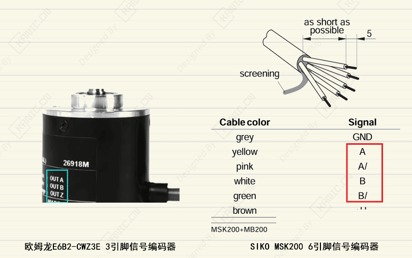

# 编码器正反方向这点事，早点想清楚-PART-编码器-方向

**关键字**：编码器,  SIKO MSK200, 半实物仿真, PID 控制, 方向

在实验和半实物仿真中，编码器方向反了是个很常见的情况。

机构在往一个方向动，反馈却在往反方向数，问题本身不复杂，但处理方式很容易走偏。

---

## 为什么会出现正反方向？

增量式编码器本质上靠 A、B 两相信号的相位先后来判断方向。

无论是：
- 只有 A / B / Z 的单端编码器  
- 还是带 A、/A、B、/B、Z、/Z 的差分编码器  

方向判断的根本，始终是 **A、B 相位关系**。

一旦安装方向、机械结构或接线方式发生变化，编码器的“正方向”就可能和系统期望的方向不一致。

---

## 背景

### 1️⃣ 编码器机械安装方向相反

- 正常：顺时针 → A 超前 B
- 实际装反：顺时针 → B 超前 A

### 2️⃣ A / B 接线对调

- 插头方向一反
- A、B 不小心插反

### 3️⃣ 左右对称机构

- 左电机、右电机机械结构镜像
- 同样转动，编码器相位逻辑刚好相反

### 4️⃣ 控制算法的“正方向定义”固定

- 例如：
  - 位置增加 = 向前
  - 速度正 = 伸出
- 但硬件实际给的是负方向

## 常见的处理方式

最直观的做法，是在程序里把信号取反：

- 位置乘个 `-1`
- 速度再乘个 `-1`

短期能用，但模型一多、实验一换，方向问题就开始变得混乱。

---

## 更省事的做法

方向问题放在**信号最前端**处理会更干净：

- 在板卡或 I/O 层设置编码器计数方向  
- 在 Simulink 的编码器模块中直接反转方向  

这样一来，进入控制模型的信号，物理意义就是统一的。

---

## 为什么值得这么做？

方向一旦统一：
- 程序不用反复改正负号
- 不同实验之间更容易复用模型
- 后续调试也更直观

---

## 一句话总结

编码器方向不是控制算法问题，而是接口和定义问题。  
**在源头处理，后面会轻松很多。**

## 说明

>本文首发于【GitHub/Gitee】，作者：KANIC，研究方向为 自动化实验平台、控制算法验证及半实物仿真系统。

相关实验或程序已整理至 GitHub，可在 GitHub 平台搜索 KANIC-lab/KANIC 查看。

如需进一步讨论，可私信联系，并注明文章编号。文章编号位于标题末尾，以字母开头如“EXP-XXXX-XXX”