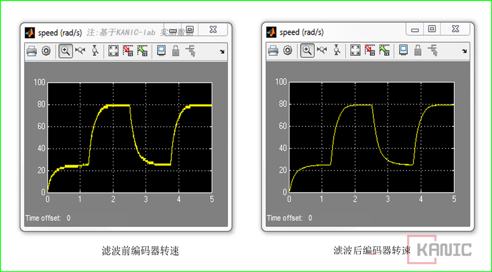

# 编码器速度：硬件测量 vs 软件微分-PART-编码器-速度

在实验和半实物仿真中，经常需要速度信息。  
传统做法是用编码器位置做微分，或者在 Simulink 里用差分计算速度。

---

## 为什么会有问题？

位置微分直接算速度，有几个坑：

- 低速时分辨率有限，速度量化粗  
- 信号里自带高频噪声，需要加滤波器  
- 需要在模型里增加传递函数或滤波块，调参麻烦  
- 实时性不够好，瞬时速度容易跳动  

总之，这种方式在慢速或者精密控制场景下，体验很容易“肉眼可见抖动”。

---

## 硬件测速度有什么优势？

如果控制设备提供**硬件速度测量**功能：

- 直接在硬件里算出速度，不用在 Simulink 里做微分  
- 分辨率更高，特别是低速下  
- 输出瞬时速度，实时性更好  
- 信号更干净，减少后续滤波需求  

简单理解就是：**把速度计算搬到信号源头，省去了软件里的繁琐补救**。

---

## 为什么值得用硬件速度？

- 模型里不用再加滤波和微分模块  
- 不同实验和程序之间速度信号统一  
- 调试更轻松，闭环控制更稳定  
- 特别适合慢速或者精密运动实验  

---

## 小结

速度测量不是只能靠位置微分。  
如果硬件支持，根据需要选择用硬件速度信号，信号更干净，省事省心。  

**这和前面说的编码器方向问题一样：能在源头解决的，就别留到软件里折腾。**

## 说明

>本文首发于【GitHub/Gitee】，作者：KANIC，研究方向为 自动化实验平台、控制算法验证及半实物仿真系统。

相关实验或程序已整理至 GitHub，可在 GitHub 平台搜索 KANIC-lab/KANIC 查看。

如需进一步讨论，可私信联系，并注明文章编号。文章编号位于标题末尾，以字母开头如“EXP-XXXX-XXX”