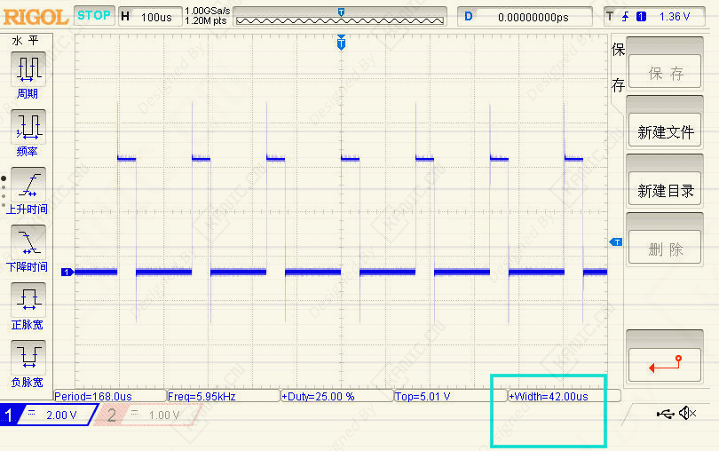

- # RC 舵机信号对比：PWM vs (One-shot)-PART-单脉冲-舵机

  **关键字**：单脉冲, On-shot, PWM, 舵机,  自动化控制
  
  ## 背景 
  - RC 舵机控制信号本质是脉冲宽度决定角度  
  - **标准 PWM** 周期长（20ms），脉冲占比低（1–2ms），大部分周期浪费  
  - 对于 **高速多舵机、无人机飞控、高精度机械臂**，传统 PWM 响应慢、精度不够  
  - **单次脉冲 / One-shot**：每次触发输出一次脉冲，脉冲短、刷新快，解决延迟和精度问题  

  ---
  
  ## 核心问题
  - Standard PWM：周期长，精度有限，响应慢  
  - 单次模式：只输出一次脉冲，精度高、刷新快  

  ---
  
  ## 单次模式优势
  - **高精度**：脉冲宽度充分利用计时器  
  - **低延迟**：可提前触发下一脉冲  
  - **灵活控制**：脉冲间隔可软件或硬件管理  
  - **适用场景**：无人机飞控、高速多舵机、高精度机器人  

  ---

  ## 循环 PWM vs 单/多脉冲
  
  | 特性     | Standard PWM   | 单/多脉冲                      |
  | -------- | -------------- | ------------------------------ |
  | 输出方式 | 每 20ms 循环   | 每次触发一次                   |
  | 脉冲占比 | 5–10%          | 100% 时间用于脉冲              |
  | 精度     | 中等           | 高                             |
  | 响应速度 | 慢             | 快                             |
  | 使用场景 | 普通航模、舵机 | 高速无人机、多舵机、高精度控制 |

  ---

  ## 协议示例
  
  | 协议          | 脉冲/周期         | 特点                     |
  | ------------- | ----------------- | ------------------------ |
  | 标准 PWM      | 1–2ms / 20ms      | 普通 RC 舵机             |
  | 单脉冲125     | 125–250μs / 500μs | 快速单次脉冲，多舵机控制 |
  | 单脉冲42      | 42–84μs / 168μs   | 更短脉冲，高刷新率       |
  | 多脉冲        | 5–25μs / 50μs     | 极高速、多通道           |
  | DShot150–2400 | 16-bit 数字包     | 数字协议，高精度低延迟   |

  ---

  ## 举例

  - 这是一个自己做的单脉冲程序（如 单脉冲42），波形上显示循环脉冲，是因为 Simulink 里设置了循环输出，实际可以单次触发控制。

    
  
  ## 结论
  - 单次模式解决 Standard PWM 精度低、响应慢问题  
  - 高速、多舵机、高精度场景必选单次/数字协议  
  - 普通航模、低速舵机用 Standard PWM 就够
  
  ## ***说明***
  
  - >本文首发于【GitHub/Gitee】，作者：KANIC，研究方向为 自动化实验平台、控制算法验证及半实物仿真系统。
  
    相关实验或程序已整理至 GitHub，可在 GitHub 平台搜索 KANIC-lab/KANIC 查看。
  
    如需进一步讨论，可私信联系，并注明文章编号。文章编号位于标题末尾，以字母开头如“EXP-XXXX-XXX”

​	
