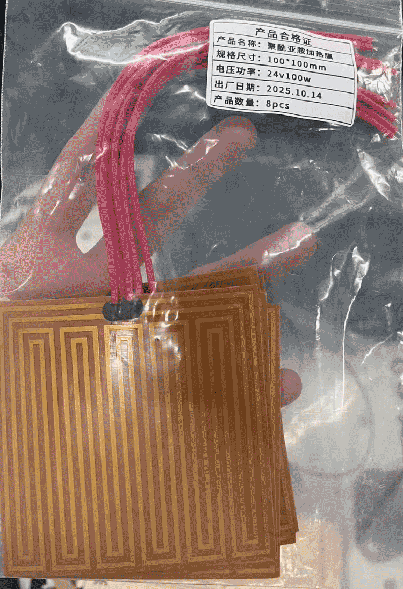

# PWM电加热膜控制案例分享-PART-PWM-加热膜

**关键字：**PWM、占空比、电加热膜、线性功放、温控

## ⚡ 技术场景
在高校自动化实验室增化控制实验中，需要对**电加热膜**进行温度控制。实验设备特点如下：  

- **控制对象**：电加热膜（24V，约100W）  
- **传感器**：温度传感器反馈至控制器  
- **原实验条件**：实验室配有四路按键式方块电源，可提供所需电压与功率，但该电源仅支持人工设定，无法通过 Simulink 或控制器进行实时调节，因此不适合闭环控制实验。  
- 实验目标是通过控制器实现对电加热膜的自动温控，但受限于现场设备条件。

---

## 🛠 现场遇到的问题
1. 实验室现有电源无法直接由控制器调节 → 无法实现自动控制。  
2. 学生急于验证实验，现场缺乏开放式电源或线性功率放大器。  
3. 尝试用PWM模块和原有电源组合控制电加热膜，经过实际测试，输出线性度和精度差强人意。  

---

## 🔍 工程原因分析
1. **电源受限**：手动方块电源没有控制接口，无法通过控制器直接调节。  
2. **PWM调压局限**：通过占空比调节电压，虽然能够快速实现控制，但线性度和精度有限，实际测量发现跟踪效果不理想。  
3. **线性功放/恒流源缺失**：理论上最优的方案是线性功率放大器或恒流源，可保证输出精度和线性，但现场没有此类设备。  

---

## 💡 处理思路与实际做法
- 在现场条件受限下，选择了**PWM模块（用户在某宝采购telesky） + 原电源组合（24VDC）**的方案来驱动电加热膜。

  **负载电压=PWM占空比*24V  **

- 实测发现：PWM控制可以工作，但线性度和精度不够，跟踪效果不理想。

- 由于电加热膜直接贴合被控对象，为降低试错风险，实验初期先用 **5Ω/100W 功率电阻**代替真实负载，对PWM调压效果进行摸底验证。

   

  | PWM 占空比(%) | 电加热膜负载电压测量值(V) | 电加热膜负载期望电压(V) |
  | ------------- | ------------------------- | ----------------------- |
  | 0%            | 0.00                      | 0.00                    |
  | 10%           | 3.70                      | 2.40                    |
  | 20%           | 6.10                      | 4.80                    |
  | 30%           | 8.40                      | 7.20                    |
  | 40%           | 10.86                     | 9.60                    |
  | 50%           | 13.24                     | 12.00                   |
  | 60%           | 15.60                     | 14.40                   |
  | 70%           | 18.00                     | 16.80                   |
  | 80%           | 20.30                     | 19.20                   |
  | 90%           | 22.82                     | 21.60                   |
  | 100%          | 23.70                     | 24.00                   |

- 经验提示：  
  - 如果用户需要高精度温控，建议**一步到位**使用线性功率放大器或恒流源。  
  - 如果现场条件有限，也可以用PWM方案快速验证实验，但需注意精度不足的问题。 （见上述数据） 

> ⚠️ 小结：这个案例展示了设备受限下的实验折中方案及其局限，后续用户可借鉴此经验，避免重复试错。

---

## 🔑 说明

1. >本文首发于【GitHub/Gitee】，作者：KANIC，研究方向为 自动化实验平台、控制算法验证及半实物仿真系统。

   相关实验或程序已整理至 GitHub，可在 GitHub 平台搜索 KANIC-lab/KANIC 查看。

   如需进一步讨论，可私信联系，并注明文章编号。文章编号位于标题末尾，以字母开头如“EXP-XXXX-XXX”