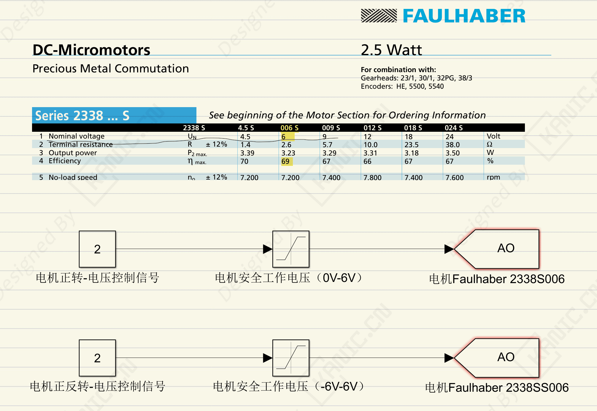

# Simulink电机控制安全-PART-直流电机-限位器

**关键字：**Simulink、Faulhaber 2338S006、安全、直流电机、限幅模块

## 一、问题分析

在高校或实验室自动化控制实验中，常见的问题是**Simulink控制器与实际硬件设备的连接不当**，尤其是对电机类设备。  

案例中，学生在控制Faulhaber 2338S006直流电机时，容易忽略了**设备的安全电压范围**。电机标称工作电压为 **6V**，如果控制信号超过这个范围，就可能导致电机损坏。  

常见风险包括：  
- 控制器输出信号直接与电机相连，没有电压限制 → 电机烧毁  
- 控制器正负转控制逻辑未匹配 → 电机运行异常或反向冲击  
- 学生实验时未考虑设备耐受能力 → 实验进度受影响  

这种情况不仅影响实验进度，还会增加设备维修成本，是**理解硬件保护和控制信号设计的重要案例**。  

---

## 二、处理方法与解决方案

针对以上问题，可以采用以下方案确保设备安全与实验可控性：  

1. **使用限位器**  
   
   - 将Simulink控制信号通过限位器映射到电机安全工作电压范围。  
   - 例如电机工作电压为0–6V，则将Simlink信号映射到0–6V之间，无论控制器输出如何，都不会超过电机极限。  
   
2. **正反转控制**  
   
   - 对于需要正负转的双向电机，可将相位器映射改为 -6V ~ +6V。  
   - 电机根据电压正负方向自动正转或反转，同时仍受电压限制保护。  
   
3. **软件与硬件双重保护**  
   - 在Simlink中增加**信号限幅模块**，避免输出异常值。   
   
4. **实验前的参数确认**  
   
   - 检查电机额定电压、电流和控制器最大输出。  
   - 制定安全范围映射策略，确保实验过程中设备始终工作在安全区间。  
   
   

---

## 三、经验小结

- **适用范围**：直流电机、步进电机、双向电机的Simulink控制实验  
- **注意事项**：  
  - 控制器输出信号不要直接接入电机  
  - 正负转映射要与电机允许电压对应  
  - 软件限幅与硬件保护结合更安全  

> **经验提示**：这个案例体现了实验室安全设计的重要性，也是学生进入工业岗位后必须遵守的基本规则：控制信号安全→设备安全→实验/工程安全。

---

## 四、🔑 说明

1. >本文首发于【GitHub/Gitee】，作者：KANIC，研究方向为 自动化实验平台、控制算法验证及半实物仿真系统。

   相关实验或程序已整理至 GitHub，可在 GitHub 平台搜索 KANIC-lab/KANIC 查看。

   如需进一步讨论，可私信联系，并注明文章编号。文章编号位于标题末尾，以字母开头如“EXP-XXXX-XXX”