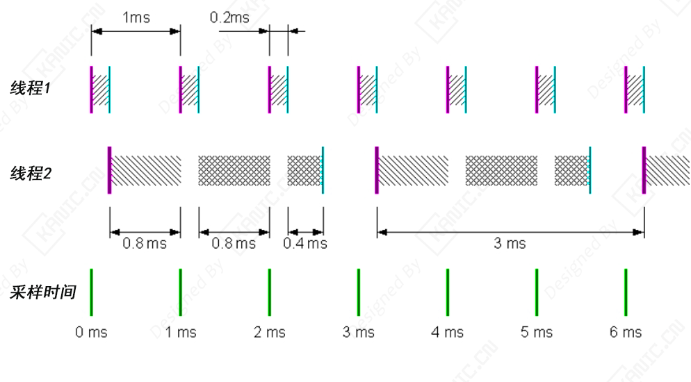
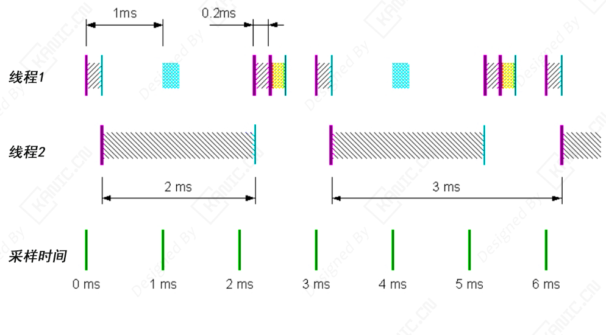

# ⚡ 实时控制也能多线程？高效并行机制解析

多线程执行可显著提升复杂控制系统效率。不同采样率的算法可以在独立线程中并行运行，例如 **1 kHz 高速控制** ⚡ 与 **100 Hz 轨迹规划** 🛠️ 同时进行，各线程互不干扰。在 **双核 CPU 系统** 💻 中，线程可同时运行在各自核心上，充分利用计算资源；单任务模式下则无法发挥多核优势。

💡 **举例**：想象一个自动化机械臂，快速控制电机位置（1 kHz）同时执行慢速路径规划（100 Hz），多线程能保证高速控制随时响应，慢速规划也不会被延迟。

多核平台可灵活分配核心，例如在四核系统中仅使用 **CPU 0 和 CPU 2** 🖥️，从而实现：

- 🌟 **更低 CPU 占用率** → 系统负载更轻，可支持更多任务
- ⚡ **更快响应速度** → 控制算法执行更及时
- 🔋 **减少功耗** → 高效利用核心降低能耗
- ✅ **保证高采样率任务稳定执行** → 实时控制可靠
- 🎯 **仿真精度更高** → 精确反映系统动态

通过这种机制，可实现 **多线程、多速率模型的高效并行执行**，在复杂实时控制和仿真场景中保持高性能与可靠性。

---

## 🏎️ 单 CPU 下的多线程多任务模式

在单 CPU 系统中，通过多线程可以为不同任务创建独立线程。例如，一个 **1 ms 高速任务（T1）** ⚡ 和一个 **3 ms 低速任务（T2）** 🛠️ 可以分别运行在各自线程中。T1 优先级高，会在需要时打断 T2 执行，确保高速任务 **不丢采样** ✅ 并保持最小延迟。同时，T2 被打断后可以继续执行，保证 **低速任务也不丢采样**，延迟固定且可控，抖动最小。

💡 **举例**：在无人机控制中，高速飞行控制（T1）可以打断低速导航计算（T2），确保飞行姿态始终精准，同时导航路径计算仍然完整执行。

⚡ **单 CPU 下的多线程多任务模式**

一个线程的运行时间为 1 毫秒，另一个线程的运行时间为 3 毫秒。任务 T1 分配给一个线程，任务 T2 在另一个线程中运行。第一个线程 (T1) 的优先级高于第二个线程 (T2)。此场景的时序图如下所示：

---

## 🖥️ 多 CPU 下的单任务模式

如果只使用单线程执行，即使多 CPU 系统也只能创建一个线程，所有任务在同一个线程中顺序执行。高优先级任务（T1）⚡ 无法打断低优先级任务（T2）🛠️，可能导致 **采样丢失** ❌ 或任务延迟累积。为避免丢采样，必须限制各任务总计算时间小于高速任务采样时间，这对复杂模型是一大限制。

💡 **举例**：如果无人机单线程执行，高速飞控（T1）可能错过采样点，导致飞行姿态控制延迟或震荡，降低系统可靠性。

⚡ **多CPU下的单任务模式**

在这种模式下，即使存在多个采样率，也只会创建一个线程来执行模型中的所有模块。因此，任务 T1 和 T2 必须在同一个线程中运行。Simulink 在常规仿真中使用的任务优先级方案也是如此。模块仍然根据其采样时间被分组为不同的“任务”，但这些任务都在同一个线程中执行。采样时间为 1 毫秒的任务 (T1) 被赋予更高的优先级，而采样时间为 3 毫秒的任务 (T2) 则被赋予较低的优先级。此场景的时序图如下所示：

相比之下，多线程模式无需受此限制，高速任务和低速任务可独立调度，**响应及时且无采样丢失** ✅，显著提升实时控制系统的可靠性和灵活性。

---

