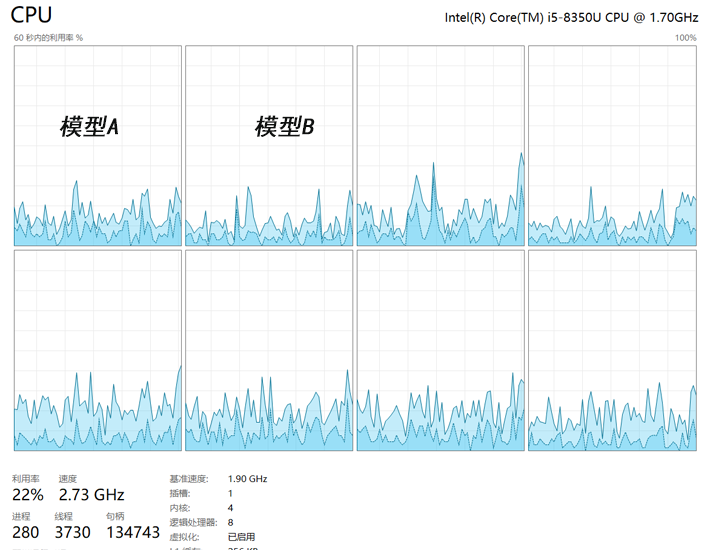

# ⚡ 多核并行优化与 多核绑定 实践

现代仿真与控制系统中，**💻 多核 CPU 的智能利用** 至关重要。本方案结合 **多线程并发** 与 **绑定多核 (BMP)** 技术，实现高性能模型运行。

## 🌐 核心技术
- 🧵 **多线程 SMP**：线程可在任意核心执行，实现真正并行
- ⏱️ **多速率线程分配**：每个采样速率独立线程
- 🎯 **绑定多核 (BMP)**：模型固定在指定核心，提升性能
- 🔗 **CPU 亲和性**：保证关键模型优先 CPU 时间

## 📝 举例说明
- ⚡ **多速率系统示例**：  
  一个工业仿真系统同时控制 **电机速度和位置**。速度采样每 1ms，位置采样每 10ms。通过多线程，每个采样率独立线程运行在不同核心。这样就避免了“速度线程卡住位置线程”的情况，使系统保持高响应、低延迟，同时 **充分利用 CPU 核心资源**。
  
- 🎯 **绑定多核 (BMP) 示例**：  
  系统中有两个模型：模型 A 负责 **核心控制逻辑**，对实时性要求高；模型 B 负责 **数据记录**，对延迟容忍度高。通过 BMP，可以将模型 A 固定在 CPU 核心 0，模型 B 固定在核心 1。即便后台有其他进程运行，模型 A 的控制逻辑仍能稳定执行，不会受到干扰，同时 **减少缓存重载、提高性能稳定性**。
  
  

## 🚀 实际收益
- ⚡ **性能提升**：充分利用所有 CPU 核心
- 🔒 **稳定运行**：关键模型核心专属，防止冲突
- 🎛️ **精细控制**：灵活管理核心分配
- 🧠 **缓存优化**：减少迁移导致的缓存重载

-----

